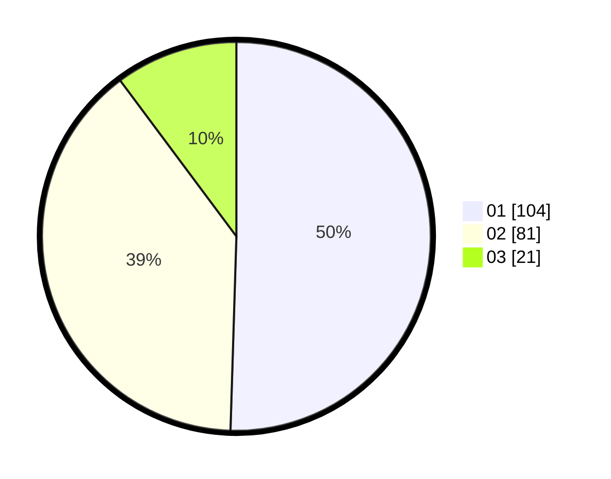

# Hasil

Hasil perolehan suara paslon dapat dilihat pada file paslon-01.txt, paslon-02.txt, dan paslon-03.txt.

Jika tidak ada, artinya data tersebut belum ada pada SIREKAP.

## Perolehan Suara

 * Paslon 01: **104**.
 * Paslon 02: **81**.
 * Paslon 03: **21**.

## Foto C Plano

https://sirekap-obj-formc.kpu.go.id/d6b1/pemilu/ppwp/31/74/09/10/04/3174091004062-20240214-212039--57569f44-a63b-4583-b2b1-907d123acebf.jpg

https://sirekap-obj-formc.kpu.go.id/d6b1/pemilu/ppwp/31/74/09/10/04/3174091004062-20240214-212242--7848627c-55ab-4cc5-8f2e-019ef8f08b8b.jpg

https://sirekap-obj-formc.kpu.go.id/d6b1/pemilu/ppwp/31/74/09/10/04/3174091004062-20240216-132740--23022670-040d-40cf-a93a-2c44e9606c74.jpg

## DATA PEMILIH TETAP

Jumlah pemilih dalam DPT: **240**.
 * L: **120**.
 * P: **120**.

## DATA PENGGUNA HAK PILIH

Jumlah pengguna hak pilih dalam DPT: **206**.
 * L: **103**.
 * P: **103**.

Jumlah pengguna hak pilih dalam DPTb: **0**.
 * L: **0**.
 * P: **0**.

Jumlah pengguna hak pilih dalam DPK: **0**.
 * L: **0**.
 * P: **0**.

Jumlah pengguna hak pilih: **206**.
 * L: **103**.
 * P: **103**.

## JUMLAH SUARA SAH DAN TIDAK SAH

JUMLAH SELURUH SUARA SAH: **206**.

JUMLAH SUARA TIDAK SAH: **0**.

JUMLAH SELURUH SUARA SAH DAN SUARA TIDAK SAH: **206**.
