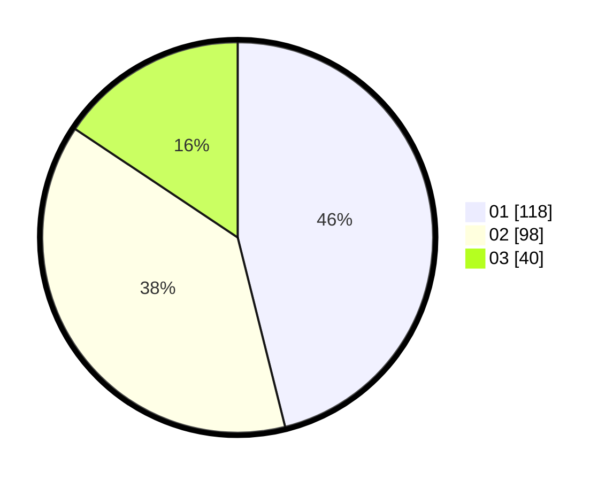

# Hasil

Hasil perolehan suara paslon dapat dilihat pada file paslon-01.txt, paslon-02.txt, dan paslon-03.txt.

Jika tidak ada, artinya data tersebut belum ada pada SIREKAP.

## Perolehan Suara

 * Paslon 01: **118**.
 * Paslon 02: **98**.
 * Paslon 03: **40**.

## Foto C Plano

https://sirekap-obj-formc.kpu.go.id/0567/pemilu/ppwp/31/74/09/10/04/3174091004068-20240216-060822--7b8c20a6-fb88-48e1-bf29-20b0b2f0e27e.jpg

https://sirekap-obj-formc.kpu.go.id/0567/pemilu/ppwp/31/74/09/10/04/3174091004068-20240216-060336--0e08420d-a44a-4dfd-950f-bd0cbee3dba3.jpg

https://sirekap-obj-formc.kpu.go.id/0567/pemilu/ppwp/31/74/09/10/04/3174091004068-20240216-060427--e9b3b59f-e21b-4961-9f8d-e7a26cef856c.jpg

## DATA PEMILIH TETAP

Jumlah pemilih dalam DPT: **252**.
 * L: **122**.
 * P: **130**.

## DATA PENGGUNA HAK PILIH

Jumlah pengguna hak pilih dalam DPT: **252**.
 * L: **122**.
 * P: **130**.

Jumlah pengguna hak pilih dalam DPTb: **4**.
 * L: **3**.
 * P: **1**.

Jumlah pengguna hak pilih dalam DPK: **6**.
 * L: **4**.
 * P: **2**.

Jumlah pengguna hak pilih: **262**.
 * L: **129**.
 * P: **133**.

## JUMLAH SUARA SAH DAN TIDAK SAH

JUMLAH SELURUH SUARA SAH: **256**.

JUMLAH SUARA TIDAK SAH: **6**.

JUMLAH SELURUH SUARA SAH DAN SUARA TIDAK SAH: **262**.
