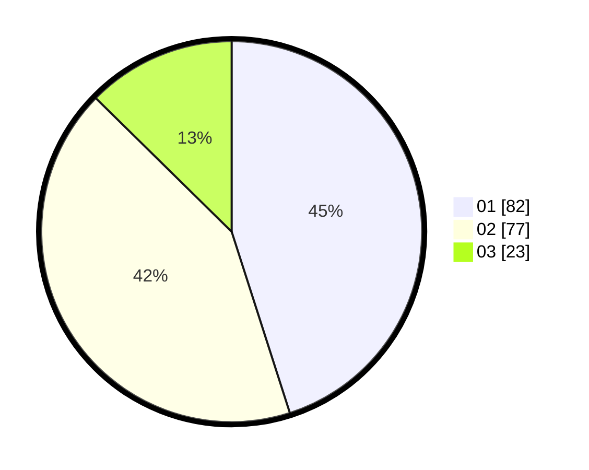

# Hasil

Hasil perolehan suara paslon dapat dilihat pada file paslon-01.txt, paslon-02.txt, dan paslon-03.txt.

Jika tidak ada, artinya data tersebut belum ada pada SIREKAP.

## Perolehan Suara

 * Paslon 01: **82**.
 * Paslon 02: **77**.
 * Paslon 03: **23**.

## Foto C Plano

https://sirekap-obj-formc.kpu.go.id/9f14/pemilu/ppwp/31/74/09/10/04/3174091004080-20240214-234354--acb1a48a-618f-4e57-bd4a-671d980aa306.jpg

https://sirekap-obj-formc.kpu.go.id/9f14/pemilu/ppwp/31/74/09/10/04/3174091004080-20240214-192134--ccf99c2e-eabb-47cd-aeef-1e7b9b371eec.jpg

https://sirekap-obj-formc.kpu.go.id/9f14/pemilu/ppwp/31/74/09/10/04/3174091004080-20240214-234302--5fe1a547-3530-4136-b30f-f696ff122104.jpg
