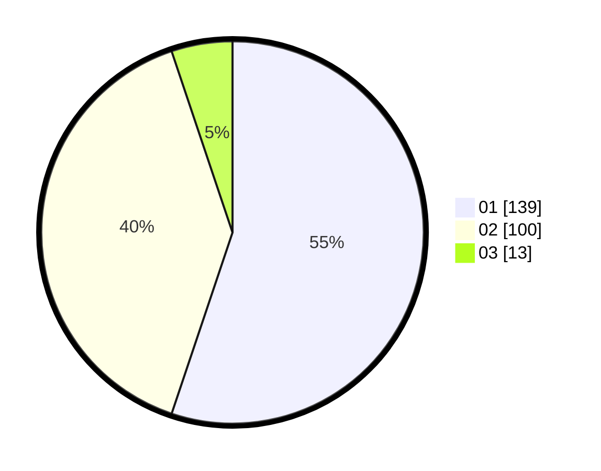

# Hasil

Hasil perolehan suara paslon dapat dilihat pada file paslon-01.txt, paslon-02.txt, dan paslon-03.txt.

Jika tidak ada, artinya data tersebut belum ada pada SIREKAP.

## Perolehan Suara

 * Paslon 01: **139**.
 * Paslon 02: **100**.
 * Paslon 03: **13**.

## Foto C Plano

https://sirekap-obj-formc.kpu.go.id/32d8/pemilu/ppwp/31/74/09/10/04/3174091004082-20240214-191943--30398c6a-d9b5-451f-b485-3be20fee74bd.jpg

https://sirekap-obj-formc.kpu.go.id/32d8/pemilu/ppwp/31/74/09/10/04/3174091004082-20240214-190850--ab16b27d-c9e0-4783-ac7e-51bebb141ffc.jpg

https://sirekap-obj-formc.kpu.go.id/32d8/pemilu/ppwp/31/74/09/10/04/3174091004082-20240214-191819--ba0730b7-ce1f-4eb8-bd22-ffa9be2ef3c6.jpg
