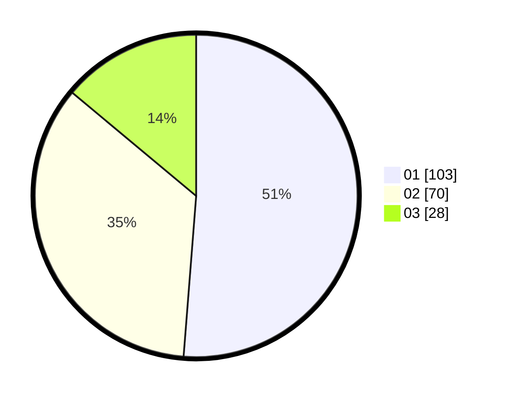

# Hasil

Hasil perolehan suara paslon dapat dilihat pada file paslon-01.txt, paslon-02.txt, dan paslon-03.txt.

Jika tidak ada, artinya data tersebut belum ada pada SIREKAP.

## Perolehan Suara

 * Paslon 01: **103**.
 * Paslon 02: **70**.
 * Paslon 03: **28**.

## Foto C Plano

https://sirekap-obj-formc.kpu.go.id/edce/pemilu/ppwp/31/74/09/10/04/3174091004089-20240217-223702--9eb77ba1-770e-447e-abbf-72c70450a03d.jpg

https://sirekap-obj-formc.kpu.go.id/edce/pemilu/ppwp/31/74/09/10/04/3174091004089-20240217-223703--2a25529e-54e6-4e05-a488-1a2a5b7560e3.jpg

https://sirekap-obj-formc.kpu.go.id/edce/pemilu/ppwp/31/74/09/10/04/3174091004089-20240217-223703--9068ebd9-ffb2-4ab0-977c-7e8399617d54.jpg

## DATA PEMILIH TETAP

Jumlah pemilih dalam DPT: **247**.
 * L: **113**.
 * P: **134**.

## DATA PENGGUNA HAK PILIH

Jumlah pengguna hak pilih dalam DPT: **205**.
 * L: **87**.
 * P: **113**.

Jumlah pengguna hak pilih dalam DPTb: **0**.
 * L: **0**.
 * P: **0**.

Jumlah pengguna hak pilih dalam DPK: **0**.
 * L: **0**.
 * P: **0**.

Jumlah pengguna hak pilih: **205**.
 * L: **87**.
 * P: **118**.

## JUMLAH SUARA SAH DAN TIDAK SAH

JUMLAH SELURUH SUARA SAH: **201**.

JUMLAH SUARA TIDAK SAH: **4**.

JUMLAH SELURUH SUARA SAH DAN SUARA TIDAK SAH: **205**.
