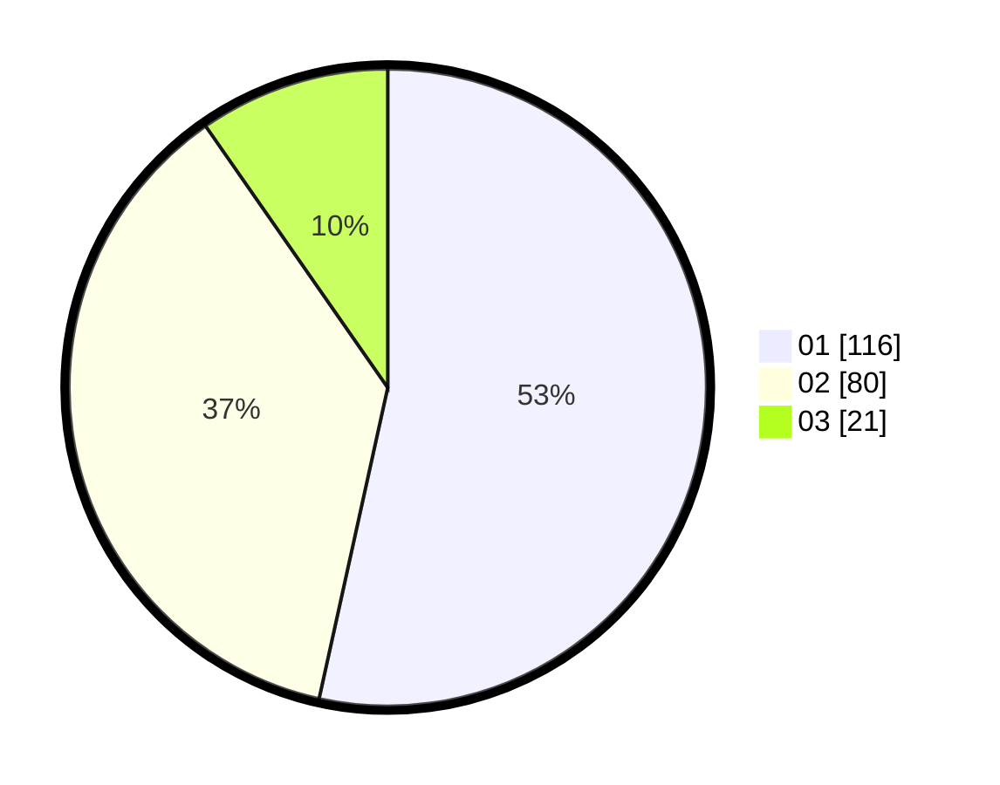

# Hasil

Hasil perolehan suara paslon dapat dilihat pada file paslon-01.txt, paslon-02.txt, dan paslon-03.txt.

Jika tidak ada, artinya data tersebut belum ada pada SIREKAP.

## Perolehan Suara

 * Paslon 01: **116**.
 * Paslon 02: **80**.
 * Paslon 03: **21**.

## Foto C Plano

https://sirekap-obj-formc.kpu.go.id/b373/pemilu/ppwp/31/74/09/10/04/3174091004093-20240214-185858--1d8fbe5f-2def-4922-bb04-c2191dde8a51.jpg

https://sirekap-obj-formc.kpu.go.id/b373/pemilu/ppwp/31/74/09/10/04/3174091004093-20240214-162234--de096d90-75fc-4035-ae5f-3530d58e70d4.jpg

https://sirekap-obj-formc.kpu.go.id/b373/pemilu/ppwp/31/74/09/10/04/3174091004093-20240214-162226--37326a51-896a-469f-b330-33415e5c7e90.jpg

## DATA PEMILIH TETAP

Jumlah pemilih dalam DPT: **272**.
 * L: **135**.
 * P: **137**.

## DATA PENGGUNA HAK PILIH

Jumlah pengguna hak pilih dalam DPT: **214**.
 * L: **104**.
 * P: **110**.

Jumlah pengguna hak pilih dalam DPTb: **3**.
 * L: **1**.
 * P: **2**.

Jumlah pengguna hak pilih dalam DPK: **1**.
 * L: **0**.
 * P: **1**.

Jumlah pengguna hak pilih: **218**.
 * L: **105**.
 * P: **113**.

## JUMLAH SUARA SAH DAN TIDAK SAH

JUMLAH SELURUH SUARA SAH: **217**.

JUMLAH SUARA TIDAK SAH: **1**.

JUMLAH SELURUH SUARA SAH DAN SUARA TIDAK SAH: **218**.
