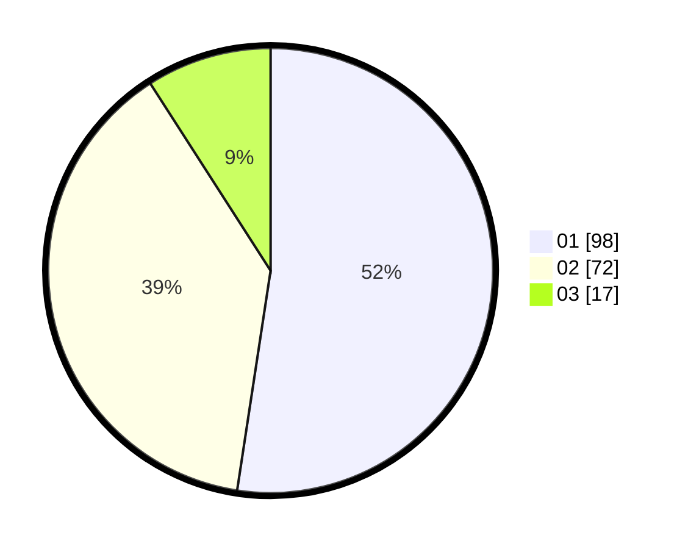

# Hasil

Hasil perolehan suara paslon dapat dilihat pada file paslon-01.txt, paslon-02.txt, dan paslon-03.txt.

Jika tidak ada, artinya data tersebut belum ada pada SIREKAP.

## Perolehan Suara

 * Paslon 01: **98**.
 * Paslon 02: **72**.
 * Paslon 03: **17**.

## Foto C Plano

https://sirekap-obj-formc.kpu.go.id/e7fd/pemilu/ppwp/31/74/09/10/04/3174091004096-20240216-071843--f070440d-7634-4238-8d7e-ebcbf0aa3163.jpg

https://sirekap-obj-formc.kpu.go.id/e7fd/pemilu/ppwp/31/74/09/10/04/3174091004096-20240216-071844--1175022b-c8ba-44ba-9da8-097864fbafd6.jpg

https://sirekap-obj-formc.kpu.go.id/e7fd/pemilu/ppwp/31/74/09/10/04/3174091004096-20240216-071843--86845fd8-d849-4f39-a01c-5f08e6caf91f.jpg

## DATA PEMILIH TETAP

Jumlah pemilih dalam DPT: **231**.
 * L: **104**.
 * P: **127**.

## DATA PENGGUNA HAK PILIH

Jumlah pengguna hak pilih dalam DPT: **191**.
 * L: **83**.
 * P: **108**.

Jumlah pengguna hak pilih dalam DPTb: **1**.
 * L: **0**.
 * P: **1**.

Jumlah pengguna hak pilih dalam DPK: **1**.
 * L: **1**.
 * P: **0**.

Jumlah pengguna hak pilih: **193**.
 * L: **84**.
 * P: **109**.

## JUMLAH SUARA SAH DAN TIDAK SAH

JUMLAH SELURUH SUARA SAH: **187**.

JUMLAH SUARA TIDAK SAH: **6**.

JUMLAH SELURUH SUARA SAH DAN SUARA TIDAK SAH: **193**.
