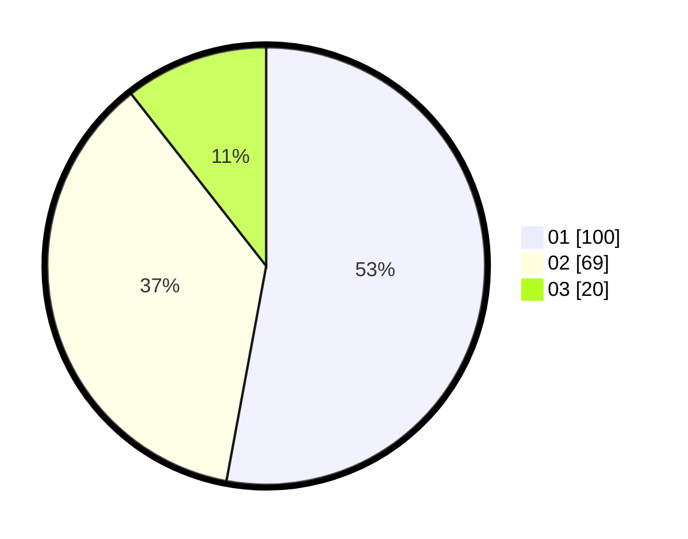

# Hasil

Hasil perolehan suara paslon dapat dilihat pada file paslon-01.txt, paslon-02.txt, dan paslon-03.txt.

Jika tidak ada, artinya data tersebut belum ada pada SIREKAP.

## Perolehan Suara

 * Paslon 01: **100**.
 * Paslon 02: **69**.
 * Paslon 03: **20**.

## Foto C Plano

https://sirekap-obj-formc.kpu.go.id/9aac/pemilu/ppwp/31/74/09/10/04/3174091004100-20240214-155022--819d9273-866d-4e7c-aeff-86fe36522dc7.jpg

https://sirekap-obj-formc.kpu.go.id/9aac/pemilu/ppwp/31/74/09/10/04/3174091004100-20240214-155552--6b823e18-84ea-4646-a6c8-865f2a82dc8e.jpg

https://sirekap-obj-formc.kpu.go.id/9aac/pemilu/ppwp/31/74/09/10/04/3174091004100-20240214-155815--aa97010c-58a7-4093-99fd-5c2134009ee8.jpg

## DATA PEMILIH TETAP

Jumlah pemilih dalam DPT: **222**.
 * L: **108**.
 * P: **114**.

## DATA PENGGUNA HAK PILIH

Jumlah pengguna hak pilih dalam DPT: **191**.
 * L: **89**.
 * P: **102**.

Jumlah pengguna hak pilih dalam DPTb: **0**.
 * L: **0**.
 * P: **0**.

Jumlah pengguna hak pilih dalam DPK: **0**.
 * L: **0**.
 * P: **0**.

Jumlah pengguna hak pilih: **191**.
 * L: **89**.
 * P: **102**.

## JUMLAH SUARA SAH DAN TIDAK SAH

JUMLAH SELURUH SUARA SAH: **189**.

JUMLAH SUARA TIDAK SAH: **2**.

JUMLAH SELURUH SUARA SAH DAN SUARA TIDAK SAH: **191**.
