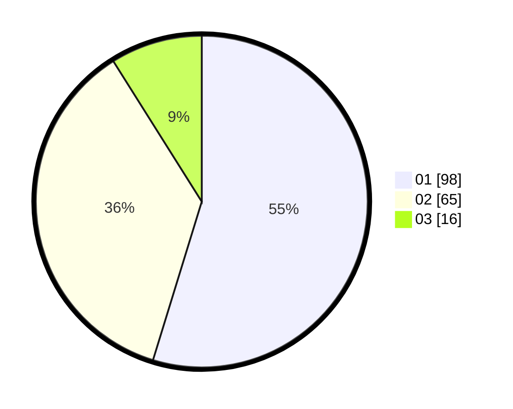

# Hasil

Hasil perolehan suara paslon dapat dilihat pada file paslon-01.txt, paslon-02.txt, dan paslon-03.txt.

Jika tidak ada, artinya data tersebut belum ada pada SIREKAP.

## Perolehan Suara

 * Paslon 01: **98**.
 * Paslon 02: **65**.
 * Paslon 03: **16**.

## Foto C Plano

https://sirekap-obj-formc.kpu.go.id/2eca/pemilu/ppwp/31/74/09/10/04/3174091004101-20240214-190037--e0fd917e-b8ad-4fe2-9c4d-3596dd93268d.jpg

https://sirekap-obj-formc.kpu.go.id/2eca/pemilu/ppwp/31/74/09/10/04/3174091004101-20240214-192925--39e1df9a-87f8-4283-a7da-78c073847ce2.jpg

https://sirekap-obj-formc.kpu.go.id/2eca/pemilu/ppwp/31/74/09/10/04/3174091004101-20240214-190044--78a8db61-78e3-472b-85d0-f7bc9922ebd5.jpg

## DATA PEMILIH TETAP

Jumlah pemilih dalam DPT: **213**.
 * L: **118**.
 * P: **95**.

## DATA PENGGUNA HAK PILIH

Jumlah pengguna hak pilih dalam DPT: **177**.
 * L: **92**.
 * P: **85**.

Jumlah pengguna hak pilih dalam DPTb: **0**.
 * L: **0**.
 * P: **0**.

Jumlah pengguna hak pilih dalam DPK: **2**.
 * L: **0**.
 * P: **2**.

Jumlah pengguna hak pilih: **179**.
 * L: **92**.
 * P: **87**.

## JUMLAH SUARA SAH DAN TIDAK SAH

JUMLAH SELURUH SUARA SAH: **179**.

JUMLAH SUARA TIDAK SAH: **0**.

JUMLAH SELURUH SUARA SAH DAN SUARA TIDAK SAH: **179**.
