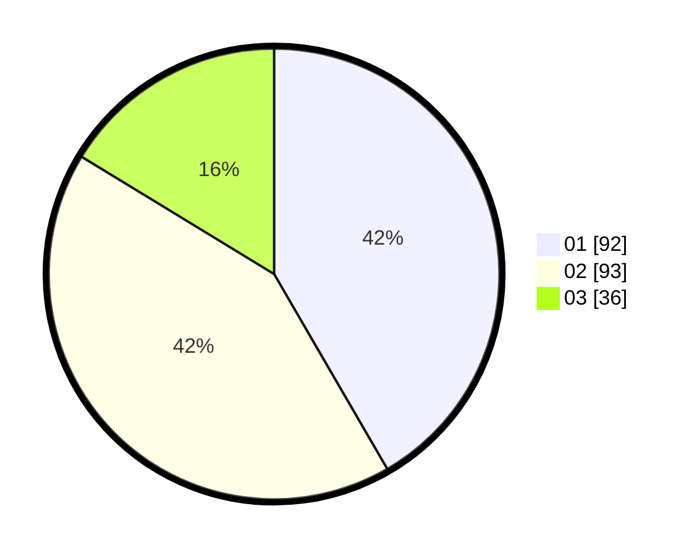

# Hasil

Hasil perolehan suara paslon dapat dilihat pada file paslon-01.txt, paslon-02.txt, dan paslon-03.txt.

Jika tidak ada, artinya data tersebut belum ada pada SIREKAP.

## Perolehan Suara

 * Paslon 01: **92**.
 * Paslon 02: **93**.
 * Paslon 03: **36**.

## Foto C Plano

https://sirekap-obj-formc.kpu.go.id/31d7/pemilu/ppwp/31/74/09/10/04/3174091004107-20240216-010751--c8a4ceda-c822-4ceb-b86c-31e06f4ed11f.jpg

https://sirekap-obj-formc.kpu.go.id/31d7/pemilu/ppwp/31/74/09/10/04/3174091004107-20240216-010754--f23d0f5b-70bc-4cc5-a840-d44bf1856f2f.jpg

https://sirekap-obj-formc.kpu.go.id/31d7/pemilu/ppwp/31/74/09/10/04/3174091004107-20240216-010753--5c72488a-b3ca-4594-9bdb-3fcd04922a2f.jpg

## DATA PEMILIH TETAP

Jumlah pemilih dalam DPT: **284**.
 * L: **139**.
 * P: **145**.

## DATA PENGGUNA HAK PILIH

Jumlah pengguna hak pilih dalam DPT: **235**.
 * L: **107**.
 * P: **128**.

Jumlah pengguna hak pilih dalam DPTb: **1**.
 * L: **0**.
 * P: **1**.

Jumlah pengguna hak pilih dalam DPK: **0**.
 * L: **0**.
 * P: **0**.

Jumlah pengguna hak pilih: **236**.
 * L: **107**.
 * P: **129**.

## JUMLAH SUARA SAH DAN TIDAK SAH

JUMLAH SELURUH SUARA SAH: **224**.

JUMLAH SUARA TIDAK SAH: **12**.

JUMLAH SELURUH SUARA SAH DAN SUARA TIDAK SAH: **236**.
