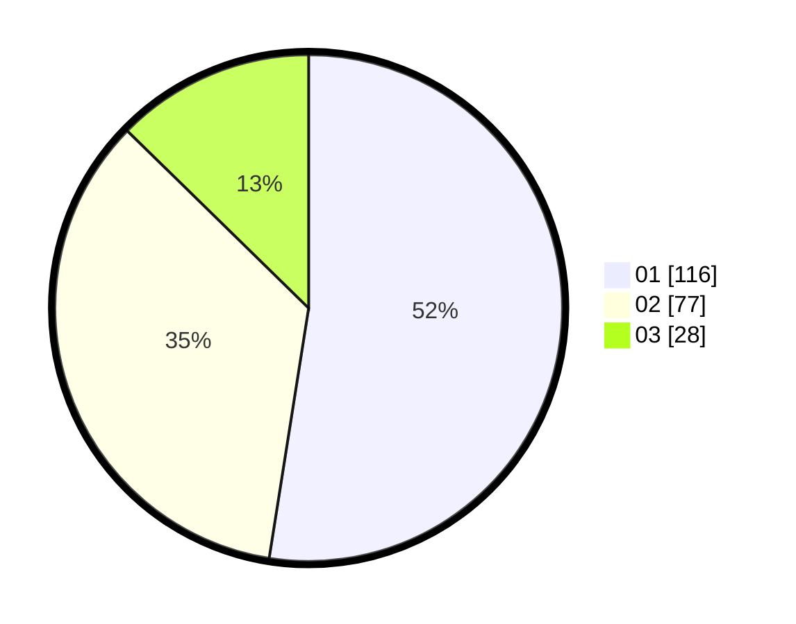

# Hasil

Hasil perolehan suara paslon dapat dilihat pada file paslon-01.txt, paslon-02.txt, dan paslon-03.txt.

Jika tidak ada, artinya data tersebut belum ada pada SIREKAP.

## Perolehan Suara

 * Paslon 01: **116**.
 * Paslon 02: **77**.
 * Paslon 03: **28**.

## Foto C Plano

https://sirekap-obj-formc.kpu.go.id/23c2/pemilu/ppwp/31/74/09/10/04/3174091004121-20240215-175337--ebe7aeb3-ecdc-4684-922d-99a11f89e9d6.jpg

https://sirekap-obj-formc.kpu.go.id/23c2/pemilu/ppwp/31/74/09/10/04/3174091004121-20240214-235356--7f5acb6e-5ae7-4192-b83e-4e220833820a.jpg

https://sirekap-obj-formc.kpu.go.id/23c2/pemilu/ppwp/31/74/09/10/04/3174091004121-20240215-213030--07cd5a3d-c067-4007-9ae0-521897c1410f.jpg

## DATA PEMILIH TETAP

Jumlah pemilih dalam DPT: **270**.
 * L: **123**.
 * P: **147**.

## DATA PENGGUNA HAK PILIH

Jumlah pengguna hak pilih dalam DPT: **226**.
 * L: **101**.
 * P: **125**.

Jumlah pengguna hak pilih dalam DPTb: **0**.
 * L: **0**.
 * P: **0**.

Jumlah pengguna hak pilih dalam DPK: **1**.
 * L: **0**.
 * P: **1**.

Jumlah pengguna hak pilih: **227**.
 * L: **101**.
 * P: **126**.

## JUMLAH SUARA SAH DAN TIDAK SAH

JUMLAH SELURUH SUARA SAH: **221**.

JUMLAH SUARA TIDAK SAH: **6**.

JUMLAH SELURUH SUARA SAH DAN SUARA TIDAK SAH: **227**.
