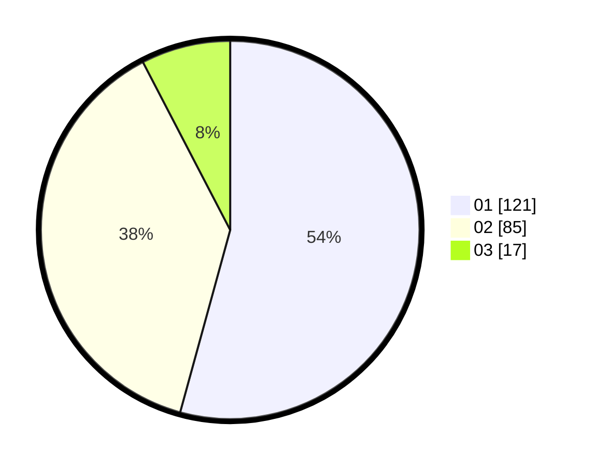

# Hasil

Hasil perolehan suara paslon dapat dilihat pada file paslon-01.txt, paslon-02.txt, dan paslon-03.txt.

Jika tidak ada, artinya data tersebut belum ada pada SIREKAP.

## Perolehan Suara

 * Paslon 01: **121**.
 * Paslon 02: **85**.
 * Paslon 03: **17**.

## Foto C Plano

https://sirekap-obj-formc.kpu.go.id/cd3e/pemilu/ppwp/31/74/09/10/04/3174091004122-20240215-005625--e483a6f8-bd61-486a-9204-5b5903661d53.jpg

https://sirekap-obj-formc.kpu.go.id/cd3e/pemilu/ppwp/31/74/09/10/04/3174091004122-20240214-233910--83aaae64-8422-4cef-b1fb-cac5cfee61ae.jpg

https://sirekap-obj-formc.kpu.go.id/cd3e/pemilu/ppwp/31/74/09/10/04/3174091004122-20240215-005729--56c41aa0-3ba5-4cfc-99c1-92ad53e50309.jpg
