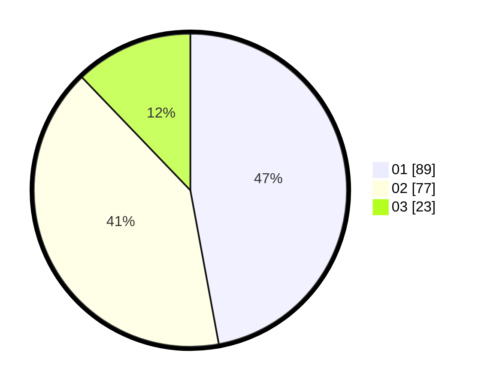

# Hasil

Hasil perolehan suara paslon dapat dilihat pada file paslon-01.txt, paslon-02.txt, dan paslon-03.txt.

Jika tidak ada, artinya data tersebut belum ada pada SIREKAP.

## Perolehan Suara

 * Paslon 01: **89**.
 * Paslon 02: **77**.
 * Paslon 03: **23**.

## Foto C Plano

https://sirekap-obj-formc.kpu.go.id/a7bf/pemilu/ppwp/31/74/09/10/04/3174091004127-20240214-155054--8e93155c-878e-4d59-9f91-172ee35078de.jpg

https://sirekap-obj-formc.kpu.go.id/a7bf/pemilu/ppwp/31/74/09/10/04/3174091004127-20240214-155140--d6c429f5-bb95-467c-953d-65e58f7f681e.jpg

https://sirekap-obj-formc.kpu.go.id/a7bf/pemilu/ppwp/31/74/09/10/04/3174091004127-20240214-155217--bf6d09ca-ebd7-41fa-a4fb-619d54268b3f.jpg

## DATA PEMILIH TETAP

Jumlah pemilih dalam DPT: **253**.
 * L: **126**.
 * P: **127**.

## DATA PENGGUNA HAK PILIH

Jumlah pengguna hak pilih dalam DPT: **192**.
 * L: **90**.
 * P: **102**.

Jumlah pengguna hak pilih dalam DPTb: **2**.
 * L: **2**.
 * P: **0**.

Jumlah pengguna hak pilih dalam DPK: **0**.
 * L: **0**.
 * P: **0**.

Jumlah pengguna hak pilih: **194**.
 * L: **92**.
 * P: **102**.

## JUMLAH SUARA SAH DAN TIDAK SAH

JUMLAH SELURUH SUARA SAH: **189**.

JUMLAH SUARA TIDAK SAH: **5**.

JUMLAH SELURUH SUARA SAH DAN SUARA TIDAK SAH: **194**.
