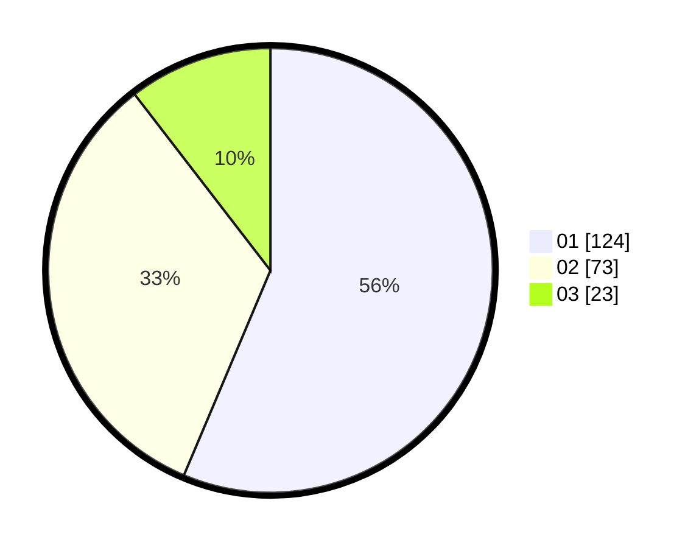

# Hasil

Hasil perolehan suara paslon dapat dilihat pada file paslon-01.txt, paslon-02.txt, dan paslon-03.txt.

Jika tidak ada, artinya data tersebut belum ada pada SIREKAP.

## Perolehan Suara

 * Paslon 01: **124**.
 * Paslon 02: **73**.
 * Paslon 03: **23**.

## Foto C Plano

https://sirekap-obj-formc.kpu.go.id/86c3/pemilu/ppwp/31/74/09/10/04/3174091004131-20240214-202830--6856003d-d694-4fc2-83c0-52a5c064f23e.jpg

https://sirekap-obj-formc.kpu.go.id/86c3/pemilu/ppwp/31/74/09/10/04/3174091004131-20240215-205730--affeeeac-794b-41b5-a548-0e3f1ed70ddd.jpg

https://sirekap-obj-formc.kpu.go.id/86c3/pemilu/ppwp/31/74/09/10/04/3174091004131-20240215-205727--47d5c7e6-c6a0-4aac-9a2f-4778581f98a7.jpg

## DATA PEMILIH TETAP

Jumlah pemilih dalam DPT: **255**.
 * L: **127**.
 * P: **128**.

## DATA PENGGUNA HAK PILIH

Jumlah pengguna hak pilih dalam DPT: **220**.
 * L: **109**.
 * P: **111**.

Jumlah pengguna hak pilih dalam DPTb: **3**.
 * L: **2**.
 * P: **1**.

Jumlah pengguna hak pilih dalam DPK: **0**.
 * L: **0**.
 * P: **0**.

Jumlah pengguna hak pilih: **223**.
 * L: **111**.
 * P: **112**.

## JUMLAH SUARA SAH DAN TIDAK SAH

JUMLAH SELURUH SUARA SAH: **220**.

JUMLAH SUARA TIDAK SAH: **3**.

JUMLAH SELURUH SUARA SAH DAN SUARA TIDAK SAH: **223**.
