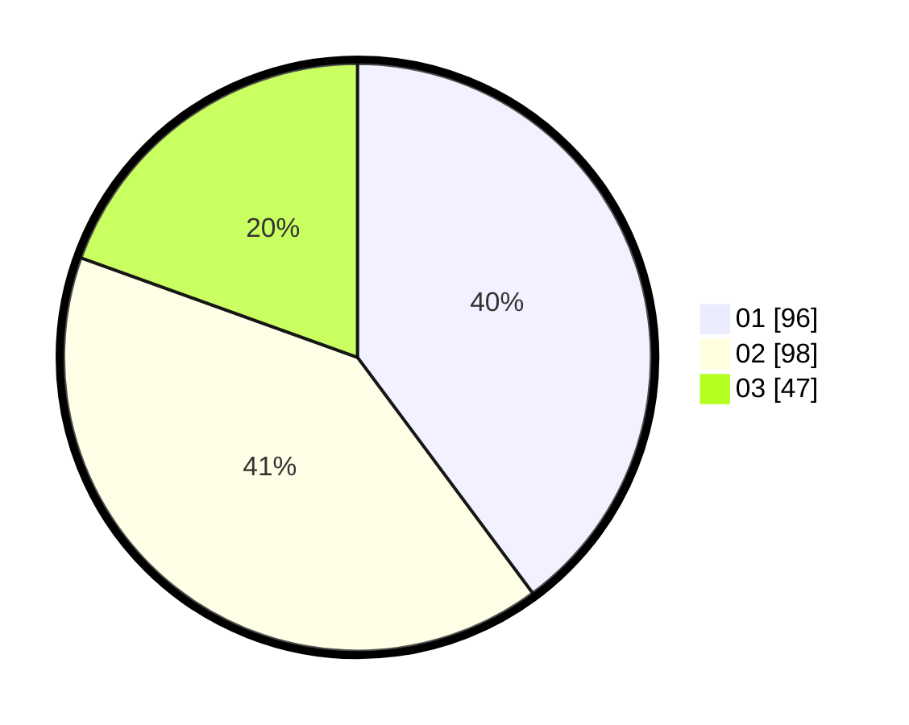

# Hasil

Hasil perolehan suara paslon dapat dilihat pada file paslon-01.txt, paslon-02.txt, dan paslon-03.txt.

Jika tidak ada, artinya data tersebut belum ada pada SIREKAP.

## Perolehan Suara

 * Paslon 01: **96**.
 * Paslon 02: **98**.
 * Paslon 03: **47**.

## Foto C Plano

https://sirekap-obj-formc.kpu.go.id/730c/pemilu/ppwp/31/74/09/10/04/3174091004147-20240214-162229--cfbf3a72-06cf-4d50-8491-9c6a88d4a718.jpg

https://sirekap-obj-formc.kpu.go.id/730c/pemilu/ppwp/31/74/09/10/04/3174091004147-20240214-190452--ea03d579-d727-4041-b93a-c4189c1d58d4.jpg

https://sirekap-obj-formc.kpu.go.id/730c/pemilu/ppwp/31/74/09/10/04/3174091004147-20240214-175325--dc9f5740-99eb-47d7-b40c-01a05e8854cd.jpg

## DATA PEMILIH TETAP

Jumlah pemilih dalam DPT: **239**.
 * L: **116**.
 * P: **123**.

## DATA PENGGUNA HAK PILIH

Jumlah pengguna hak pilih dalam DPT: **239**.
 * L: **116**.
 * P: **123**.

Jumlah pengguna hak pilih dalam DPTb: **3**.
 * L: **2**.
 * P: **1**.

Jumlah pengguna hak pilih dalam DPK: **3**.
 * L: **0**.
 * P: **3**.

Jumlah pengguna hak pilih: **245**.
 * L: **118**.
 * P: **127**.

## JUMLAH SUARA SAH DAN TIDAK SAH

JUMLAH SELURUH SUARA SAH: **241**.

JUMLAH SUARA TIDAK SAH: **4**.

JUMLAH SELURUH SUARA SAH DAN SUARA TIDAK SAH: **245**.
