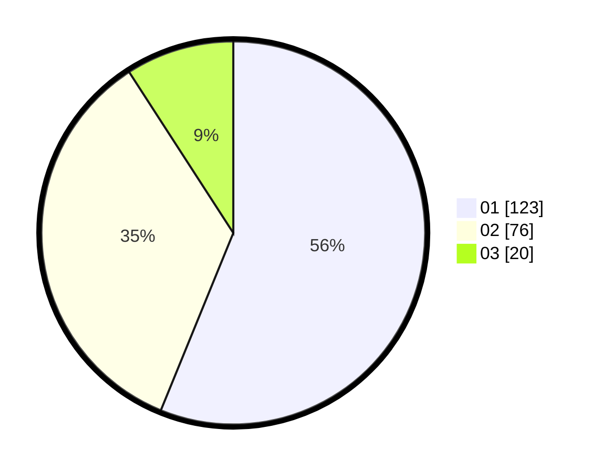

# Hasil

Hasil perolehan suara paslon dapat dilihat pada file paslon-01.txt, paslon-02.txt, dan paslon-03.txt.

Jika tidak ada, artinya data tersebut belum ada pada SIREKAP.

## Perolehan Suara

 * Paslon 01: **123**.
 * Paslon 02: **76**.
 * Paslon 03: **20**.

## Foto C Plano

https://sirekap-obj-formc.kpu.go.id/0854/pemilu/ppwp/31/74/09/10/04/3174091004166-20240214-192051--230b7e80-b271-4eca-b505-15b42f799bc5.jpg

https://sirekap-obj-formc.kpu.go.id/0854/pemilu/ppwp/31/74/09/10/04/3174091004166-20240214-221725--6d81068d-b6db-42cb-9d7f-1067e3d6a0bc.jpg

https://sirekap-obj-formc.kpu.go.id/0854/pemilu/ppwp/31/74/09/10/04/3174091004166-20240214-222015--cf02efdb-86f3-4338-b9e3-69a2025abf78.jpg
