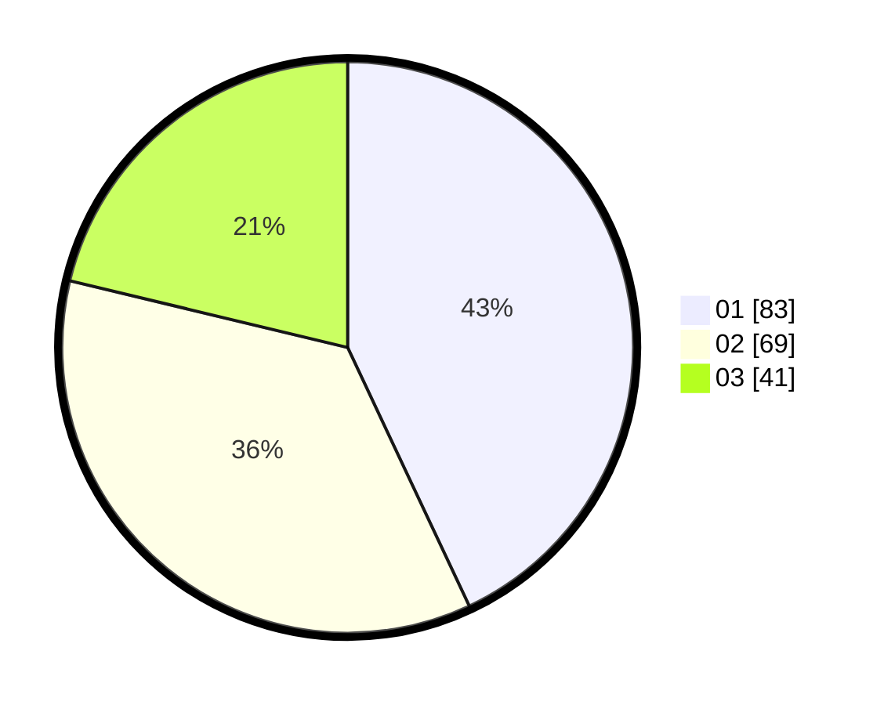

# Hasil

Hasil perolehan suara paslon dapat dilihat pada file paslon-01.txt, paslon-02.txt, dan paslon-03.txt.

Jika tidak ada, artinya data tersebut belum ada pada SIREKAP.

## Perolehan Suara

 * Paslon 01: **83**.
 * Paslon 02: **69**.
 * Paslon 03: **41**.

## Foto C Plano

https://sirekap-obj-formc.kpu.go.id/be96/pemilu/ppwp/31/74/09/10/04/3174091004174-20240214-155656--f046c973-79bb-4f5b-a398-87f1791c7338.jpg

https://sirekap-obj-formc.kpu.go.id/be96/pemilu/ppwp/31/74/09/10/04/3174091004174-20240214-155551--53dded35-d15a-470e-9db4-fd8fa6a13f08.jpg

https://sirekap-obj-formc.kpu.go.id/be96/pemilu/ppwp/31/74/09/10/04/3174091004174-20240214-155148--fdbabfb7-d45b-430e-9b39-4ae7025c7f11.jpg

## DATA PEMILIH TETAP

Jumlah pemilih dalam DPT: **250**.
 * L: **131**.
 * P: **119**.

## DATA PENGGUNA HAK PILIH

Jumlah pengguna hak pilih dalam DPT: **195**.
 * L: **101**.
 * P: **94**.

Jumlah pengguna hak pilih dalam DPTb: **2**.
 * L: **1**.
 * P: **1**.

Jumlah pengguna hak pilih dalam DPK: **3**.
 * L: **1**.
 * P: **2**.

Jumlah pengguna hak pilih: **200**.
 * L: **103**.
 * P: **97**.

## JUMLAH SUARA SAH DAN TIDAK SAH

JUMLAH SELURUH SUARA SAH: **193**.

JUMLAH SUARA TIDAK SAH: **7**.

JUMLAH SELURUH SUARA SAH DAN SUARA TIDAK SAH: **200**.
