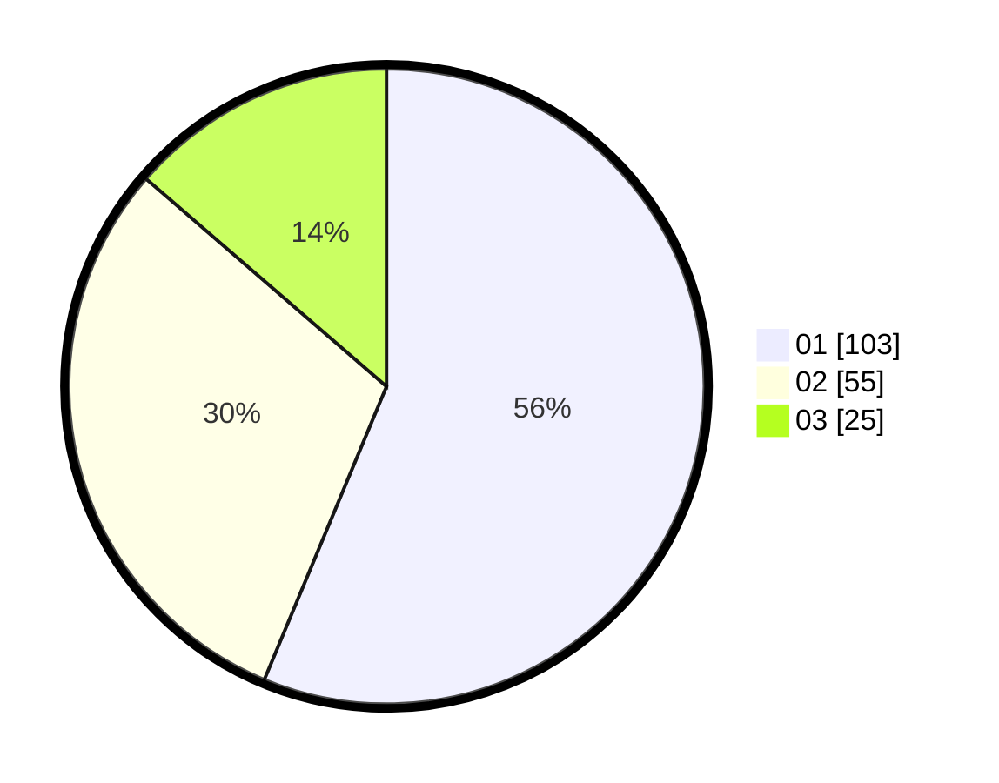

# Hasil

Hasil perolehan suara paslon dapat dilihat pada file paslon-01.txt, paslon-02.txt, dan paslon-03.txt.

Jika tidak ada, artinya data tersebut belum ada pada SIREKAP.

## Perolehan Suara

 * Paslon 01: **103**.
 * Paslon 02: **55**.
 * Paslon 03: **25**.

## Foto C Plano

https://sirekap-obj-formc.kpu.go.id/eaa6/pemilu/ppwp/31/74/09/10/04/3174091004175-20240216-095836--c68da43e-df3c-4049-81d5-22f3bdf3b9e2.jpg

https://sirekap-obj-formc.kpu.go.id/eaa6/pemilu/ppwp/31/74/09/10/04/3174091004175-20240214-203552--a8b32f4e-1e96-475d-87a9-f35c1e82af5c.jpg

https://sirekap-obj-formc.kpu.go.id/eaa6/pemilu/ppwp/31/74/09/10/04/3174091004175-20240216-095837--4fbc80bb-64f4-42f7-9a17-88ff6a4fd59f.jpg

## DATA PEMILIH TETAP

Jumlah pemilih dalam DPT: **233**.
 * L: **113**.
 * P: **120**.

## DATA PENGGUNA HAK PILIH

Jumlah pengguna hak pilih dalam DPT: **184**.
 * L: **84**.
 * P: **100**.

Jumlah pengguna hak pilih dalam DPTb: **0**.
 * L: **0**.
 * P: **0**.

Jumlah pengguna hak pilih dalam DPK: **0**.
 * L: **0**.
 * P: **0**.

Jumlah pengguna hak pilih: **184**.
 * L: **84**.
 * P: **100**.

## JUMLAH SUARA SAH DAN TIDAK SAH

JUMLAH SELURUH SUARA SAH: **183**.

JUMLAH SUARA TIDAK SAH: **1**.

JUMLAH SELURUH SUARA SAH DAN SUARA TIDAK SAH: **184**.
