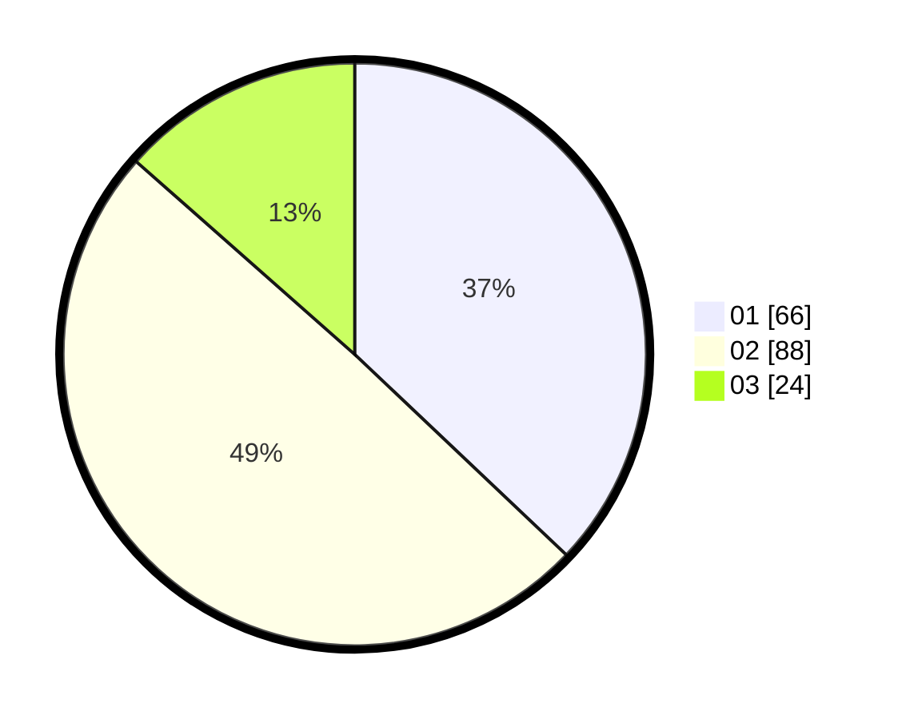

# Hasil

Hasil perolehan suara paslon dapat dilihat pada file paslon-01.txt, paslon-02.txt, dan paslon-03.txt.

Jika tidak ada, artinya data tersebut belum ada pada SIREKAP.

## Perolehan Suara

 * Paslon 01: **66**.
 * Paslon 02: **88**.
 * Paslon 03: **24**.

## Foto C Plano

https://sirekap-obj-formc.kpu.go.id/08ab/pemilu/ppwp/31/74/09/10/04/3174091004178-20240214-155830--02d45b83-3614-4714-aadd-780623d13942.jpg

https://sirekap-obj-formc.kpu.go.id/08ab/pemilu/ppwp/31/74/09/10/04/3174091004178-20240214-190842--fef9a5a3-0cb4-4dac-ba44-9bb23c802aab.jpg

https://sirekap-obj-formc.kpu.go.id/08ab/pemilu/ppwp/31/74/09/10/04/3174091004178-20240214-190848--f9a503b2-6d00-44ad-9c48-60d9934cab84.jpg

## DATA PEMILIH TETAP

Jumlah pemilih dalam DPT: **232**.
 * L: **111**.
 * P: **121**.

## DATA PENGGUNA HAK PILIH

Jumlah pengguna hak pilih dalam DPT: **182**.
 * L: **82**.
 * P: **100**.

Jumlah pengguna hak pilih dalam DPTb: **0**.
 * L: **0**.
 * P: **0**.

Jumlah pengguna hak pilih dalam DPK: **0**.
 * L: **0**.
 * P: **0**.

Jumlah pengguna hak pilih: **182**.
 * L: **82**.
 * P: **100**.

## JUMLAH SUARA SAH DAN TIDAK SAH

JUMLAH SELURUH SUARA SAH: **178**.

JUMLAH SUARA TIDAK SAH: **4**.

JUMLAH SELURUH SUARA SAH DAN SUARA TIDAK SAH: **182**.
