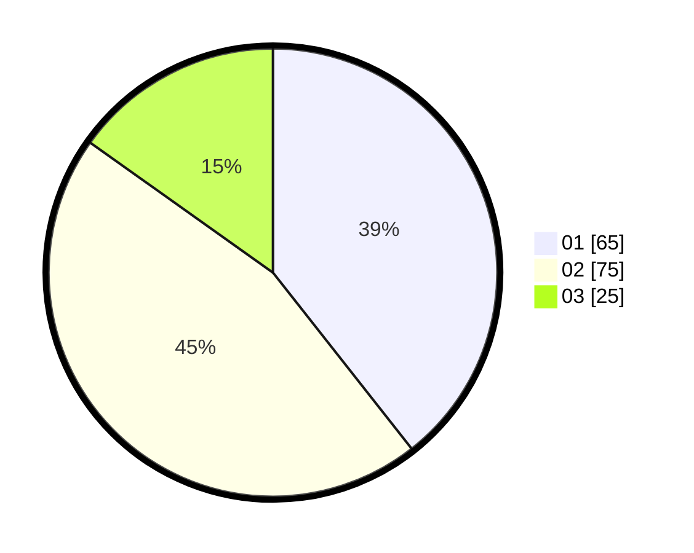

# Hasil

Hasil perolehan suara paslon dapat dilihat pada file paslon-01.txt, paslon-02.txt, dan paslon-03.txt.

Jika tidak ada, artinya data tersebut belum ada pada SIREKAP.

## Perolehan Suara

 * Paslon 01: **65**.
 * Paslon 02: **75**.
 * Paslon 03: **25**.

## Foto C Plano

https://sirekap-obj-formc.kpu.go.id/f1d3/pemilu/ppwp/31/74/09/10/04/3174091004187-20240214-185742--663797cd-0b2a-4040-8f25-b278a6acd56d.jpg

https://sirekap-obj-formc.kpu.go.id/f1d3/pemilu/ppwp/31/74/09/10/04/3174091004187-20240214-185909--854e7895-524e-47f5-afea-56e90d4bb930.jpg

https://sirekap-obj-formc.kpu.go.id/f1d3/pemilu/ppwp/31/74/09/10/04/3174091004187-20240214-190021--eccfaeba-e6f8-43d5-8e83-5efec5e4ae18.jpg

## DATA PEMILIH TETAP

Jumlah pemilih dalam DPT: **161**.
 * L: **74**.
 * P: **87**.

## DATA PENGGUNA HAK PILIH

Jumlah pengguna hak pilih dalam DPT: **161**.
 * L: **74**.
 * P: **87**.

Jumlah pengguna hak pilih dalam DPTb: **4**.
 * L: **1**.
 * P: **3**.

Jumlah pengguna hak pilih dalam DPK: **1**.
 * L: **0**.
 * P: **1**.

Jumlah pengguna hak pilih: **166**.
 * L: **75**.
 * P: **91**.

## JUMLAH SUARA SAH DAN TIDAK SAH

JUMLAH SELURUH SUARA SAH: **165**.

JUMLAH SUARA TIDAK SAH: **1**.

JUMLAH SELURUH SUARA SAH DAN SUARA TIDAK SAH: **166**.
