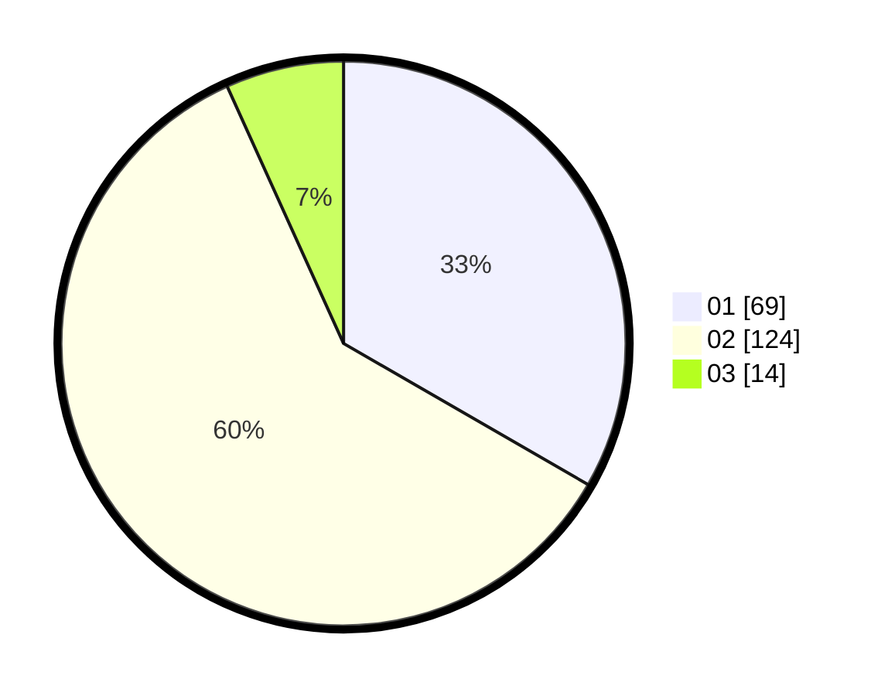

# Hasil

Hasil perolehan suara paslon dapat dilihat pada file paslon-01.txt, paslon-02.txt, dan paslon-03.txt.

Jika tidak ada, artinya data tersebut belum ada pada SIREKAP.

## Perolehan Suara

 * Paslon 01: **69**.
 * Paslon 02: **124**.
 * Paslon 03: **14**.

## Foto C Plano

https://sirekap-obj-formc.kpu.go.id/9b6e/pemilu/ppwp/31/74/09/10/04/3174091004191-20240215-072318--61b42272-8531-4ddd-942c-9d718ca86142.jpg

https://sirekap-obj-formc.kpu.go.id/9b6e/pemilu/ppwp/31/74/09/10/04/3174091004191-20240215-072946--5ac96262-19b1-404a-8f3c-971c72653674.jpg

https://sirekap-obj-formc.kpu.go.id/9b6e/pemilu/ppwp/31/74/09/10/04/3174091004191-20240215-073429--ba5c12e5-23bf-484f-95e9-07792132a70b.jpg

## DATA PEMILIH TETAP

Jumlah pemilih dalam DPT: **284**.
 * L: **157**.
 * P: **127**.

## DATA PENGGUNA HAK PILIH

Jumlah pengguna hak pilih dalam DPT: **208**.
 * L: **108**.
 * P: **100**.

Jumlah pengguna hak pilih dalam DPTb: **2**.
 * L: **1**.
 * P: **1**.

Jumlah pengguna hak pilih dalam DPK: **0**.
 * L: **0**.
 * P: **0**.

Jumlah pengguna hak pilih: **210**.
 * L: **109**.
 * P: **101**.

## JUMLAH SUARA SAH DAN TIDAK SAH

JUMLAH SELURUH SUARA SAH: **208**.

JUMLAH SUARA TIDAK SAH: **2**.

JUMLAH SELURUH SUARA SAH DAN SUARA TIDAK SAH: **210**.
