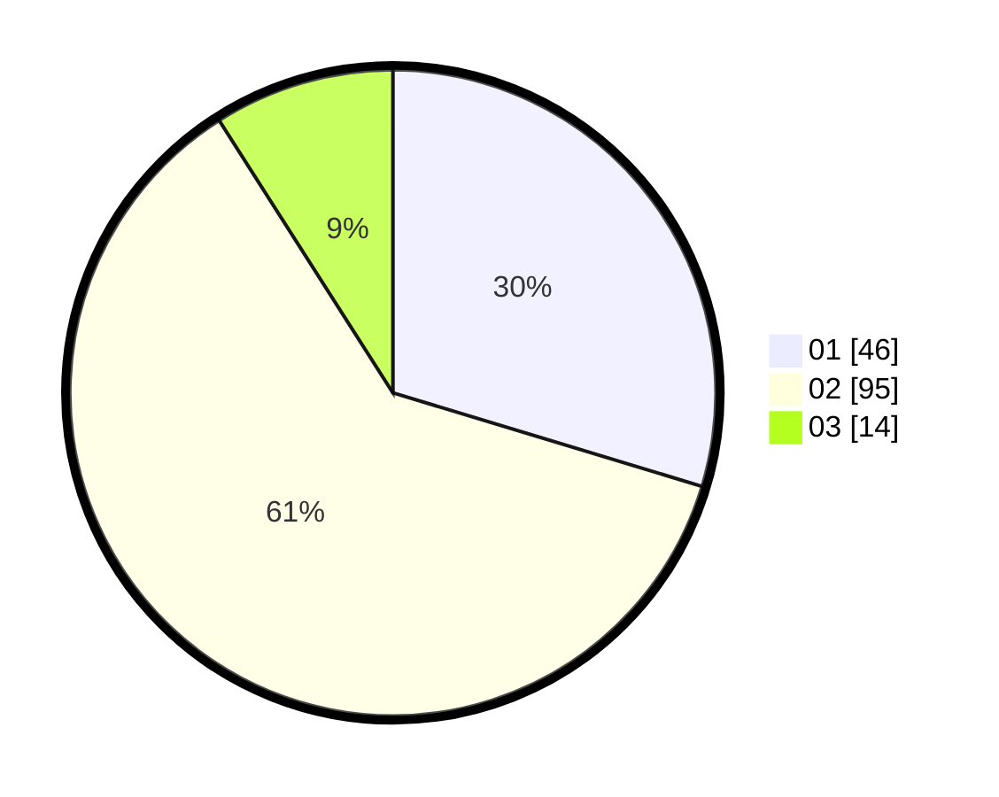

# Hasil

Hasil perolehan suara paslon dapat dilihat pada file paslon-01.txt, paslon-02.txt, dan paslon-03.txt.

Jika tidak ada, artinya data tersebut belum ada pada SIREKAP.

## Perolehan Suara

 * Paslon 01: **46**.
 * Paslon 02: **95**.
 * Paslon 03: **14**.

## Foto C Plano

https://sirekap-obj-formc.kpu.go.id/5006/pemilu/ppwp/31/74/09/10/04/3174091004195-20240215-201736--feafc5fa-f125-40d5-929f-fa78c467f0d5.jpg

https://sirekap-obj-formc.kpu.go.id/5006/pemilu/ppwp/31/74/09/10/04/3174091004195-20240215-214518--69eec949-39ef-4b8a-9f17-39e462d790cf.jpg

https://sirekap-obj-formc.kpu.go.id/5006/pemilu/ppwp/31/74/09/10/04/3174091004195-20240215-205508--7fd55282-8bbe-4cbc-9d12-224f91ed1f6f.jpg

## DATA PEMILIH TETAP

Jumlah pemilih dalam DPT: **204**.
 * L: **103**.
 * P: **101**.

## DATA PENGGUNA HAK PILIH

Jumlah pengguna hak pilih dalam DPT: **157**.
 * L: **75**.
 * P: **82**.

Jumlah pengguna hak pilih dalam DPTb: **0**.
 * L: **0**.
 * P: **0**.

Jumlah pengguna hak pilih dalam DPK: **0**.
 * L: **0**.
 * P: **0**.

Jumlah pengguna hak pilih: **157**.
 * L: **75**.
 * P: **82**.

## JUMLAH SUARA SAH DAN TIDAK SAH

JUMLAH SELURUH SUARA SAH: **156**.

JUMLAH SUARA TIDAK SAH: **1**.

JUMLAH SELURUH SUARA SAH DAN SUARA TIDAK SAH: **157**.
