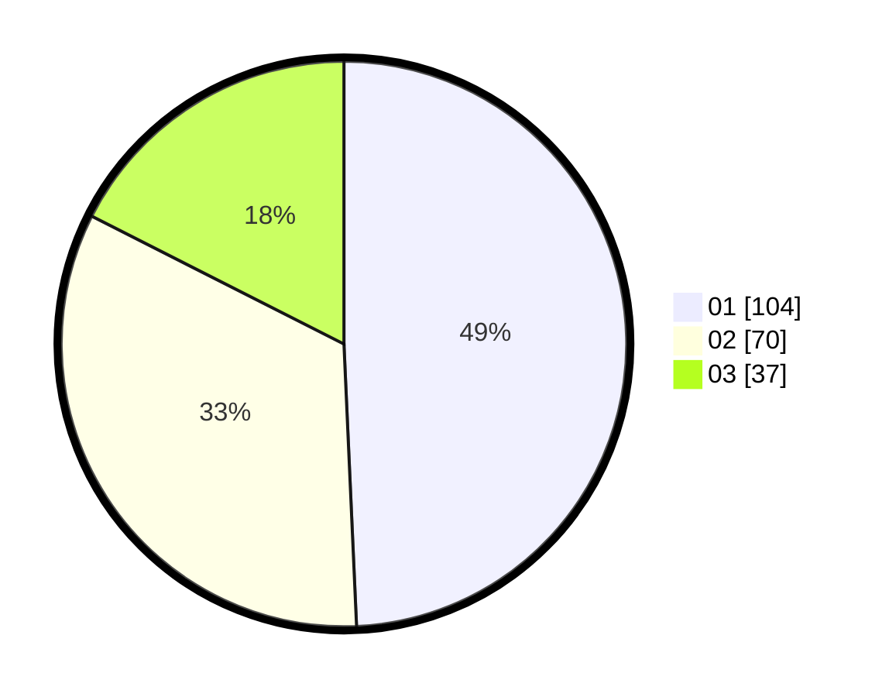

# Hasil

Hasil perolehan suara paslon dapat dilihat pada file paslon-01.txt, paslon-02.txt, dan paslon-03.txt.

Jika tidak ada, artinya data tersebut belum ada pada SIREKAP.

## Perolehan Suara

 * Paslon 01: **104**.
 * Paslon 02: **70**.
 * Paslon 03: **37**.

## Foto C Plano

https://sirekap-obj-formc.kpu.go.id/7b16/pemilu/ppwp/31/74/09/10/05/3174091005009-20240216-082052--971bb70d-5caa-43f0-b87f-be51e617a01a.jpg

https://sirekap-obj-formc.kpu.go.id/7b16/pemilu/ppwp/31/74/09/10/05/3174091005009-20240216-082328--52a07fad-caa7-4efa-9b91-ffb0fb3ef827.jpg

https://sirekap-obj-formc.kpu.go.id/7b16/pemilu/ppwp/31/74/09/10/05/3174091005009-20240214-231513--ae9a8007-54eb-4c9f-8e53-e447515f58de.jpg

## DATA PEMILIH TETAP

Jumlah pemilih dalam DPT: **262**.
 * L: **134**.
 * P: **128**.

## DATA PENGGUNA HAK PILIH

Jumlah pengguna hak pilih dalam DPT: **200**.
 * L: **103**.
 * P: **97**.

Jumlah pengguna hak pilih dalam DPTb: **13**.
 * L: **5**.
 * P: **8**.

Jumlah pengguna hak pilih dalam DPK: **1**.
 * L: **1**.
 * P: **0**.

Jumlah pengguna hak pilih: **214**.
 * L: **109**.
 * P: **105**.

## JUMLAH SUARA SAH DAN TIDAK SAH

JUMLAH SELURUH SUARA SAH: **211**.

JUMLAH SUARA TIDAK SAH: **3**.

JUMLAH SELURUH SUARA SAH DAN SUARA TIDAK SAH: **214**.
