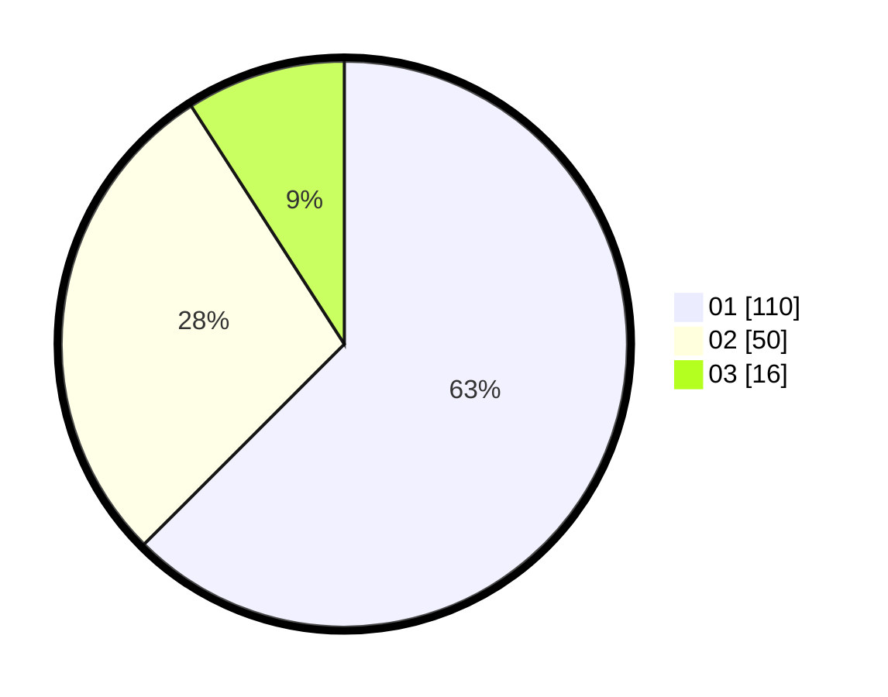

# Hasil

Hasil perolehan suara paslon dapat dilihat pada file paslon-01.txt, paslon-02.txt, dan paslon-03.txt.

Jika tidak ada, artinya data tersebut belum ada pada SIREKAP.

## Perolehan Suara

 * Paslon 01: **110**.
 * Paslon 02: **50**.
 * Paslon 03: **16**.

## Foto C Plano

https://sirekap-obj-formc.kpu.go.id/f3fd/pemilu/ppwp/31/74/09/10/05/3174091005011-20240216-191250--20d80728-e8d7-4e12-9622-26b50f78a498.jpg

https://sirekap-obj-formc.kpu.go.id/f3fd/pemilu/ppwp/31/74/09/10/05/3174091005011-20240216-192553--98ac214f-2982-410a-9b5a-550f840d6c25.jpg

https://sirekap-obj-formc.kpu.go.id/f3fd/pemilu/ppwp/31/74/09/10/05/3174091005011-20240216-193734--c25cdffc-02ac-4b01-991b-9e909d641d05.jpg

## DATA PEMILIH TETAP

Jumlah pemilih dalam DPT: **209**.
 * L: **105**.
 * P: **104**.

## DATA PENGGUNA HAK PILIH

Jumlah pengguna hak pilih dalam DPT: **168**.
 * L: **79**.
 * P: **89**.

Jumlah pengguna hak pilih dalam DPTb: **11**.
 * L: **3**.
 * P: **8**.

Jumlah pengguna hak pilih dalam DPK: **2**.
 * L: **1**.
 * P: **1**.

Jumlah pengguna hak pilih: **181**.
 * L: **83**.
 * P: **98**.

## JUMLAH SUARA SAH DAN TIDAK SAH

JUMLAH SELURUH SUARA SAH: **176**.

JUMLAH SUARA TIDAK SAH: **5**.

JUMLAH SELURUH SUARA SAH DAN SUARA TIDAK SAH: **181**.
