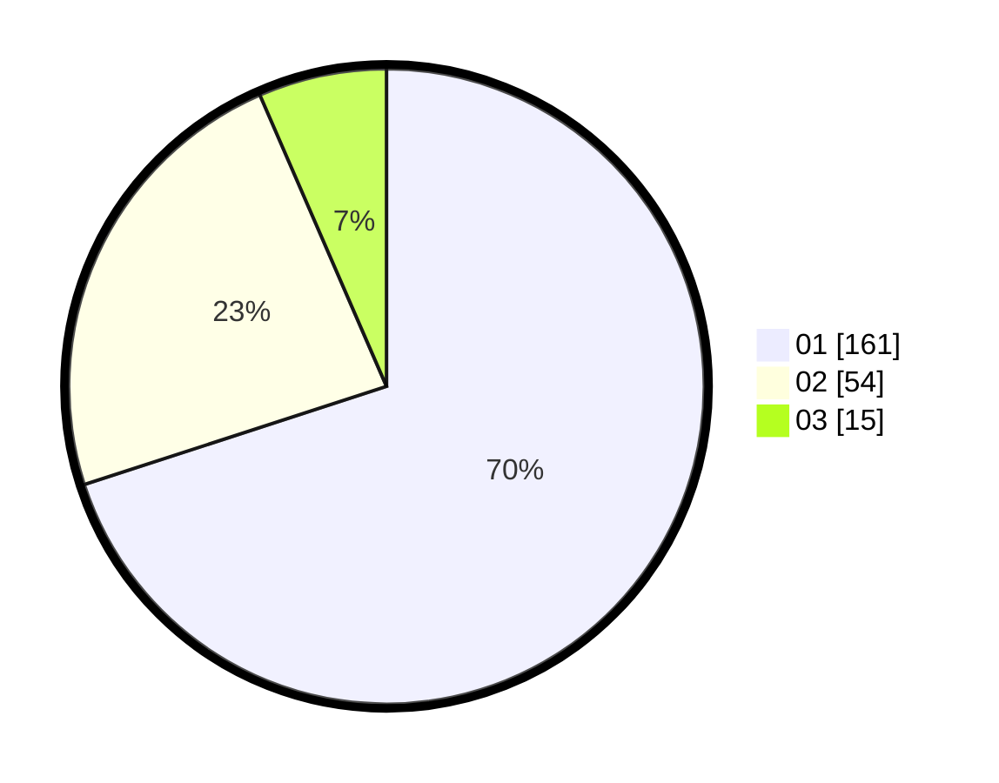

# Hasil

Hasil perolehan suara paslon dapat dilihat pada file paslon-01.txt, paslon-02.txt, dan paslon-03.txt.

Jika tidak ada, artinya data tersebut belum ada pada SIREKAP.

## Perolehan Suara

 * Paslon 01: **161**.
 * Paslon 02: **54**.
 * Paslon 03: **15**.

## Foto C Plano

https://sirekap-obj-formc.kpu.go.id/77bc/pemilu/ppwp/31/74/09/10/05/3174091005015-20240216-040415--4cb73844-2d10-43c2-b731-1a66e04fdca7.jpg

https://sirekap-obj-formc.kpu.go.id/77bc/pemilu/ppwp/31/74/09/10/05/3174091005015-20240214-211317--5204b826-6295-45d8-a484-0aa311e7076f.jpg

https://sirekap-obj-formc.kpu.go.id/77bc/pemilu/ppwp/31/74/09/10/05/3174091005015-20240216-040415--f7828205-1c24-4e05-858a-431f0ac326cb.jpg

## DATA PEMILIH TETAP

Jumlah pemilih dalam DPT: **250**.
 * L: **124**.
 * P: **126**.

## DATA PENGGUNA HAK PILIH

Jumlah pengguna hak pilih dalam DPT: **216**.
 * L: **103**.
 * P: **113**.

Jumlah pengguna hak pilih dalam DPTb: **16**.
 * L: **11**.
 * P: **5**.

Jumlah pengguna hak pilih dalam DPK: **2**.
 * L: **0**.
 * P: **2**.

Jumlah pengguna hak pilih: **234**.
 * L: **114**.
 * P: **120**.

## JUMLAH SUARA SAH DAN TIDAK SAH

JUMLAH SELURUH SUARA SAH: **230**.

JUMLAH SUARA TIDAK SAH: **4**.

JUMLAH SELURUH SUARA SAH DAN SUARA TIDAK SAH: **234**.
