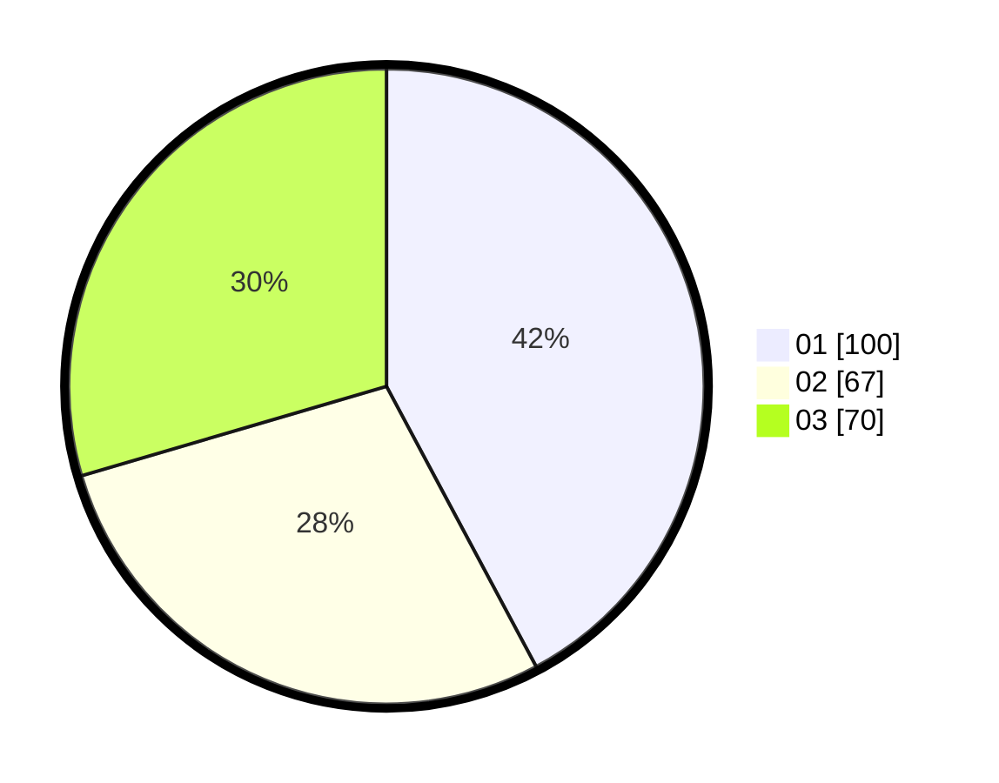

# Hasil

Hasil perolehan suara paslon dapat dilihat pada file paslon-01.txt, paslon-02.txt, dan paslon-03.txt.

Jika tidak ada, artinya data tersebut belum ada pada SIREKAP.

## Perolehan Suara

 * Paslon 01: **100**.
 * Paslon 02: **67**.
 * Paslon 03: **70**.

## Foto C Plano

https://sirekap-obj-formc.kpu.go.id/e02e/pemilu/ppwp/31/74/09/10/05/3174091005026-20240214-184725--bbae1fa6-7263-4400-95ec-6c5aa4d4584d.jpg

https://sirekap-obj-formc.kpu.go.id/e02e/pemilu/ppwp/31/74/09/10/05/3174091005026-20240214-184658--ed5bdf86-1b60-4ff2-b7f7-64d426ffe4aa.jpg

https://sirekap-obj-formc.kpu.go.id/e02e/pemilu/ppwp/31/74/09/10/05/3174091005026-20240214-185945--77af27ca-a8b2-4f06-9fba-0ee5d6be7e85.jpg

## DATA PEMILIH TETAP

Jumlah pemilih dalam DPT: **275**.
 * L: **131**.
 * P: **144**.

## DATA PENGGUNA HAK PILIH

Jumlah pengguna hak pilih dalam DPT: **224**.
 * L: **106**.
 * P: **118**.

Jumlah pengguna hak pilih dalam DPTb: **21**.
 * L: **9**.
 * P: **12**.

Jumlah pengguna hak pilih dalam DPK: **3**.
 * L: **1**.
 * P: **2**.

Jumlah pengguna hak pilih: **248**.
 * L: **116**.
 * P: **132**.

## JUMLAH SUARA SAH DAN TIDAK SAH

JUMLAH SELURUH SUARA SAH: **237**.

JUMLAH SUARA TIDAK SAH: **11**.

JUMLAH SELURUH SUARA SAH DAN SUARA TIDAK SAH: **248**.
