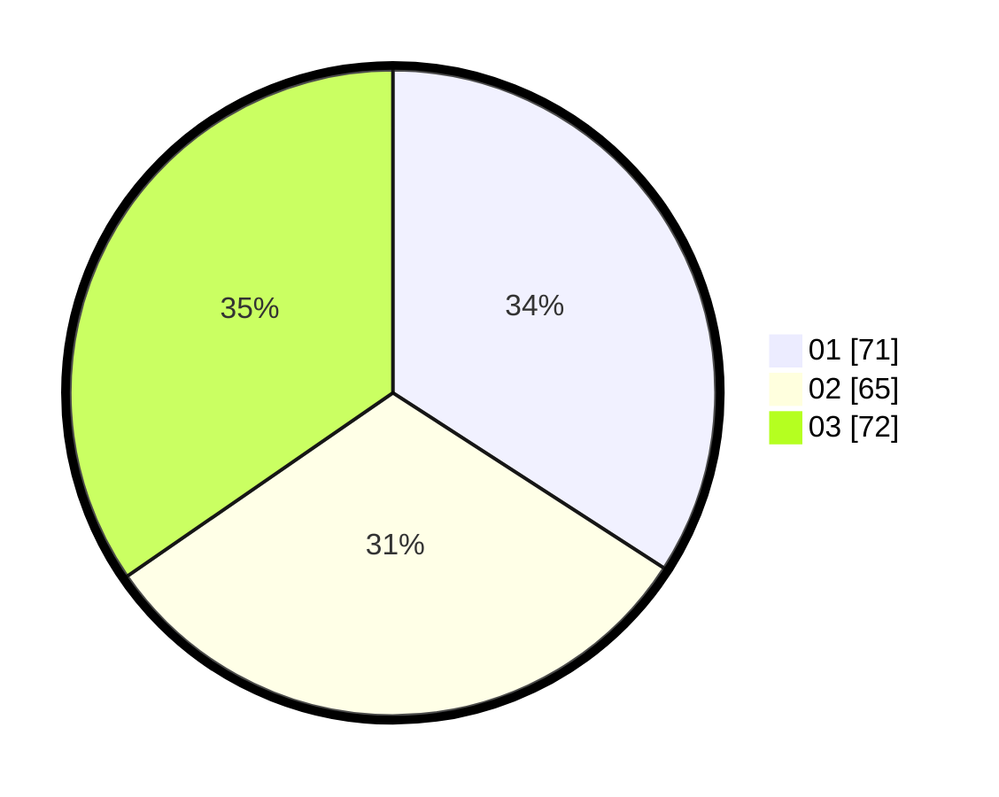

# Hasil

Hasil perolehan suara paslon dapat dilihat pada file paslon-01.txt, paslon-02.txt, dan paslon-03.txt.

Jika tidak ada, artinya data tersebut belum ada pada SIREKAP.

## Perolehan Suara

 * Paslon 01: **71**.
 * Paslon 02: **65**.
 * Paslon 03: **72**.

## Foto C Plano

https://sirekap-obj-formc.kpu.go.id/8173/pemilu/ppwp/31/74/09/10/05/3174091005028-20240216-144235--7cf28ff8-ea3e-46f6-90e3-6641b3ee957a.jpg

https://sirekap-obj-formc.kpu.go.id/8173/pemilu/ppwp/31/74/09/10/05/3174091005028-20240216-144237--32692386-489e-417f-b9ef-ca15f55b0879.jpg

https://sirekap-obj-formc.kpu.go.id/8173/pemilu/ppwp/31/74/09/10/05/3174091005028-20240216-144236--5a1a5a2f-d9af-4f53-b1ed-a8ca6f38ece3.jpg

## DATA PEMILIH TETAP

Jumlah pemilih dalam DPT: **272**.
 * L: **129**.
 * P: **143**.

## DATA PENGGUNA HAK PILIH

Jumlah pengguna hak pilih dalam DPT: **210**.
 * L: **99**.
 * P: **111**.

Jumlah pengguna hak pilih dalam DPTb: **2**.
 * L: **1**.
 * P: **1**.

Jumlah pengguna hak pilih dalam DPK: **5**.
 * L: **3**.
 * P: **2**.

Jumlah pengguna hak pilih: **217**.
 * L: **103**.
 * P: **114**.

## JUMLAH SUARA SAH DAN TIDAK SAH

JUMLAH SELURUH SUARA SAH: **208**.

JUMLAH SUARA TIDAK SAH: **9**.

JUMLAH SELURUH SUARA SAH DAN SUARA TIDAK SAH: **217**.
