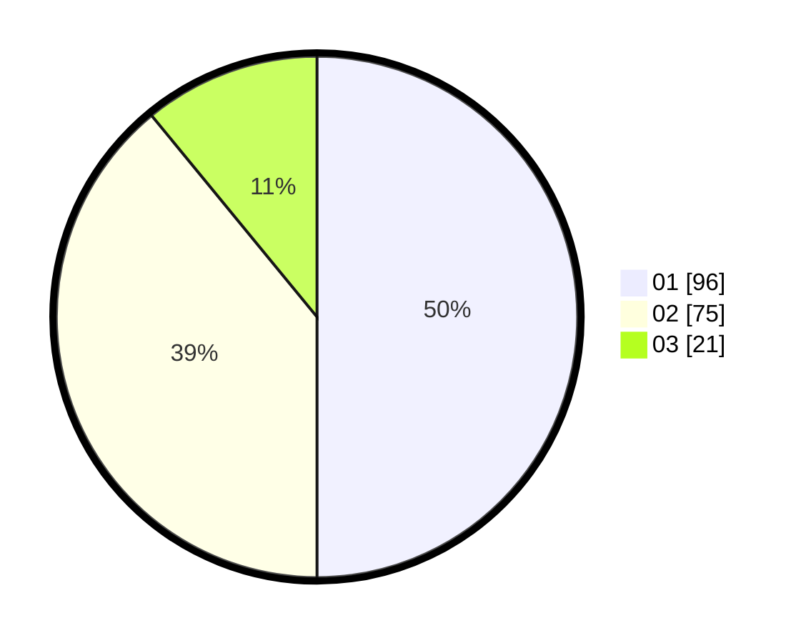

# Hasil

Hasil perolehan suara paslon dapat dilihat pada file paslon-01.txt, paslon-02.txt, dan paslon-03.txt.

Jika tidak ada, artinya data tersebut belum ada pada SIREKAP.

## Perolehan Suara

 * Paslon 01: **96**.
 * Paslon 02: **75**.
 * Paslon 03: **21**.

## Foto C Plano

https://sirekap-obj-formc.kpu.go.id/0e8c/pemilu/ppwp/31/74/09/10/05/3174091005039-20240215-220422--9884b9ac-cbae-4d5d-a359-7753fae183d6.jpg

https://sirekap-obj-formc.kpu.go.id/0e8c/pemilu/ppwp/31/74/09/10/05/3174091005039-20240214-155020--923f4ac2-b71d-45ba-8930-9517db56b5de.jpg

https://sirekap-obj-formc.kpu.go.id/0e8c/pemilu/ppwp/31/74/09/10/05/3174091005039-20240214-155231--6ae9970a-d762-4200-a85c-dfecb8a96e6b.jpg
