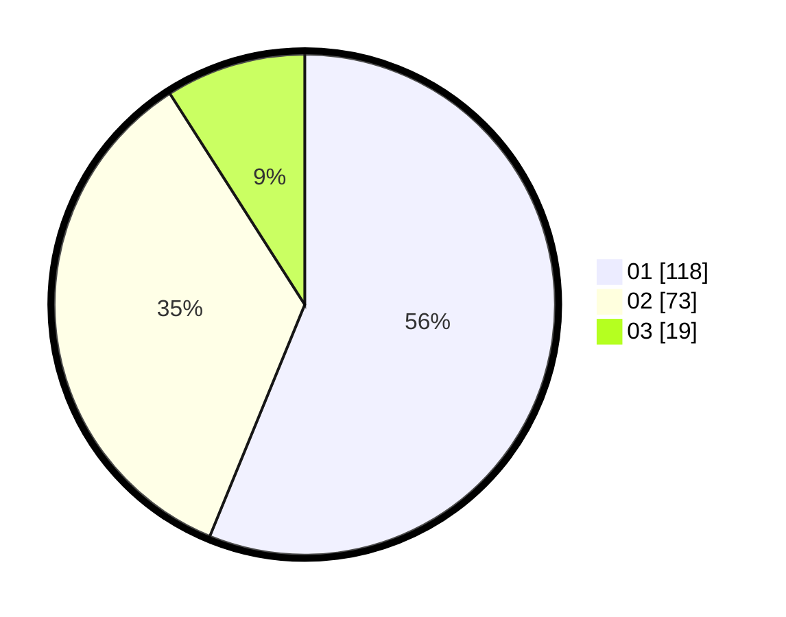

# Hasil

Hasil perolehan suara paslon dapat dilihat pada file paslon-01.txt, paslon-02.txt, dan paslon-03.txt.

Jika tidak ada, artinya data tersebut belum ada pada SIREKAP.

## Perolehan Suara

 * Paslon 01: **118**.
 * Paslon 02: **73**.
 * Paslon 03: **19**.

## Foto C Plano

https://sirekap-obj-formc.kpu.go.id/87b0/pemilu/ppwp/31/74/09/10/05/3174091005085-20240214-234021--a6505cb3-6ddb-4672-ac66-500a95d2727f.jpg

https://sirekap-obj-formc.kpu.go.id/87b0/pemilu/ppwp/31/74/09/10/05/3174091005085-20240214-234129--63d94bb4-e887-4689-83a8-e104352beaf1.jpg

https://sirekap-obj-formc.kpu.go.id/87b0/pemilu/ppwp/31/74/09/10/05/3174091005085-20240214-233849--4976313a-10ca-419f-b41b-d22831c2f466.jpg

## DATA PEMILIH TETAP

Jumlah pemilih dalam DPT: **267**.
 * L: **128**.
 * P: **137**.

## DATA PENGGUNA HAK PILIH

Jumlah pengguna hak pilih dalam DPT: **199**.
 * L: **98**.
 * P: **101**.

Jumlah pengguna hak pilih dalam DPTb: **3**.
 * L: **2**.
 * P: **1**.

Jumlah pengguna hak pilih dalam DPK: **8**.
 * L: **3**.
 * P: **5**.

Jumlah pengguna hak pilih: **270**.
 * L: **103**.
 * P: **107**.

## JUMLAH SUARA SAH DAN TIDAK SAH

JUMLAH SELURUH SUARA SAH: **210**.

JUMLAH SUARA TIDAK SAH: **0**.

JUMLAH SELURUH SUARA SAH DAN SUARA TIDAK SAH: **210**.
