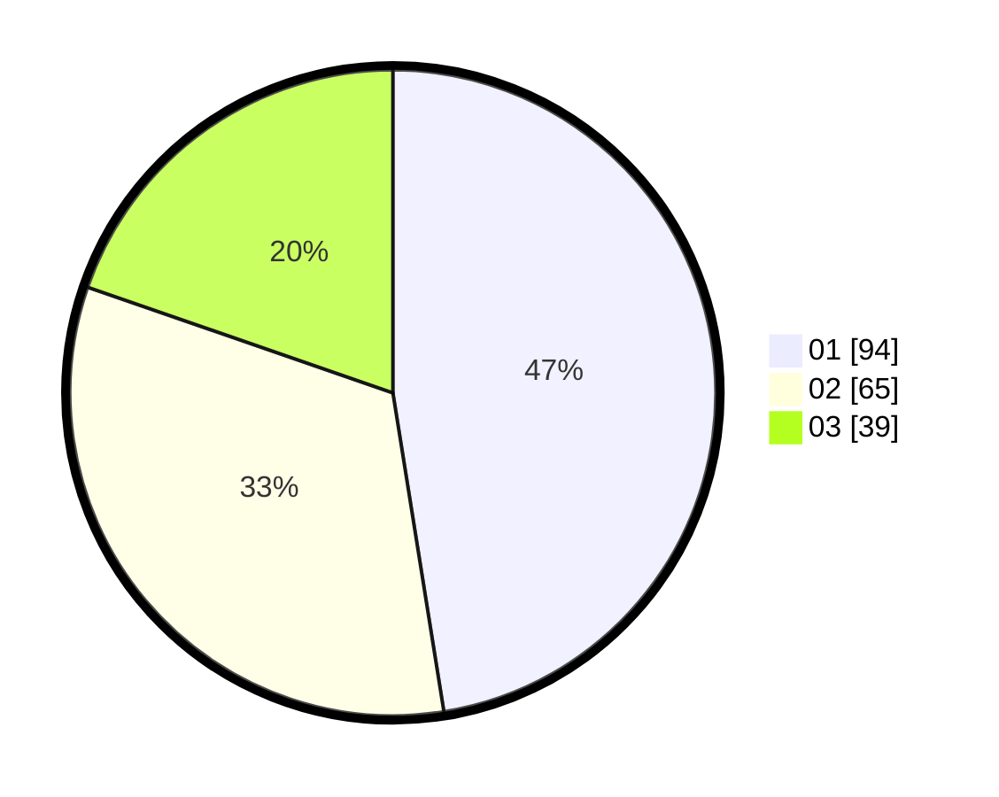

# Hasil

Hasil perolehan suara paslon dapat dilihat pada file paslon-01.txt, paslon-02.txt, dan paslon-03.txt.

Jika tidak ada, artinya data tersebut belum ada pada SIREKAP.

## Perolehan Suara

 * Paslon 01: **94**.
 * Paslon 02: **65**.
 * Paslon 03: **39**.

## Foto C Plano

https://sirekap-obj-formc.kpu.go.id/6a3d/pemilu/ppwp/31/74/09/10/05/3174091005095-20240214-205748--01e55522-913c-4ae9-9fee-5a43e02c3c48.jpg

https://sirekap-obj-formc.kpu.go.id/6a3d/pemilu/ppwp/31/74/09/10/05/3174091005095-20240214-205919--139ffefe-5c73-4fcf-9a54-3a05a93d435e.jpg

https://sirekap-obj-formc.kpu.go.id/6a3d/pemilu/ppwp/31/74/09/10/05/3174091005095-20240214-205956--1205c677-1eab-45e9-9f50-f781802e5105.jpg

## DATA PEMILIH TETAP

Jumlah pemilih dalam DPT: **264**.
 * L: **131**.
 * P: **133**.

## DATA PENGGUNA HAK PILIH

Jumlah pengguna hak pilih dalam DPT: **197**.
 * L: **96**.
 * P: **101**.

Jumlah pengguna hak pilih dalam DPTb: **1**.
 * L: **0**.
 * P: **1**.

Jumlah pengguna hak pilih dalam DPK: **6**.
 * L: **4**.
 * P: **2**.

Jumlah pengguna hak pilih: **204**.
 * L: **100**.
 * P: **104**.

## JUMLAH SUARA SAH DAN TIDAK SAH

JUMLAH SELURUH SUARA SAH: **198**.

JUMLAH SUARA TIDAK SAH: **6**.

JUMLAH SELURUH SUARA SAH DAN SUARA TIDAK SAH: **204**.
