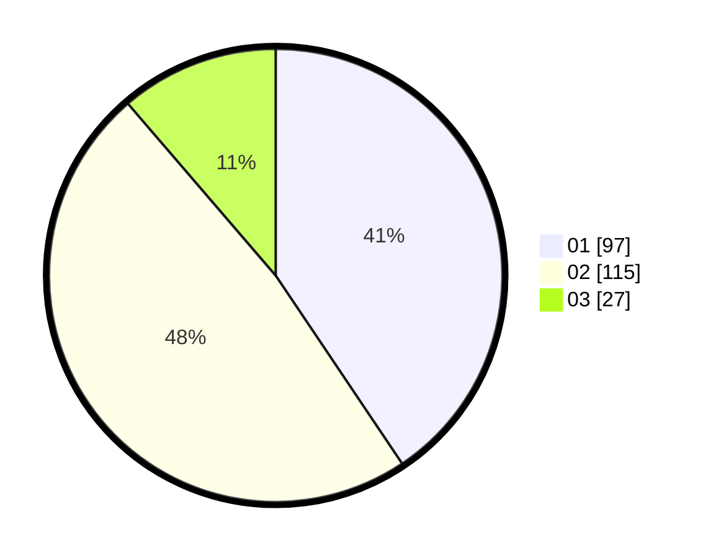

# Hasil

Hasil perolehan suara paslon dapat dilihat pada file paslon-01.txt, paslon-02.txt, dan paslon-03.txt.

Jika tidak ada, artinya data tersebut belum ada pada SIREKAP.

## Perolehan Suara

 * Paslon 01: **97**.
 * Paslon 02: **115**.
 * Paslon 03: **27**.

## Foto C Plano

https://sirekap-obj-formc.kpu.go.id/e9f6/pemilu/ppwp/31/74/09/10/06/3174091006009-20240215-032810--2634c9c9-d7ae-43fa-bc0a-ef02068f1214.jpg

https://sirekap-obj-formc.kpu.go.id/e9f6/pemilu/ppwp/31/74/09/10/06/3174091006009-20240215-032826--386eb5c1-d6b9-4b80-995b-de5876ce60d2.jpg

https://sirekap-obj-formc.kpu.go.id/e9f6/pemilu/ppwp/31/74/09/10/06/3174091006009-20240215-032832--48c9878b-4165-40fc-9456-35ef3d1efce9.jpg

## DATA PEMILIH TETAP

Jumlah pemilih dalam DPT: **282**.
 * L: **134**.
 * P: **148**.

## DATA PENGGUNA HAK PILIH

Jumlah pengguna hak pilih dalam DPT: **239**.
 * L: **111**.
 * P: **128**.

Jumlah pengguna hak pilih dalam DPTb: **2**.
 * L: **2**.
 * P: **0**.

Jumlah pengguna hak pilih dalam DPK: **3**.
 * L: **2**.
 * P: **1**.

Jumlah pengguna hak pilih: **244**.
 * L: **115**.
 * P: **129**.

## JUMLAH SUARA SAH DAN TIDAK SAH

JUMLAH SELURUH SUARA SAH: **239**.

JUMLAH SUARA TIDAK SAH: **5**.

JUMLAH SELURUH SUARA SAH DAN SUARA TIDAK SAH: **244**.
