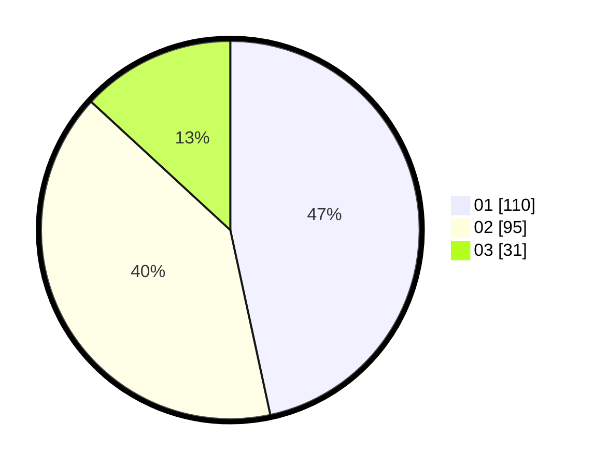

# Hasil

Hasil perolehan suara paslon dapat dilihat pada file paslon-01.txt, paslon-02.txt, dan paslon-03.txt.

Jika tidak ada, artinya data tersebut belum ada pada SIREKAP.

## Perolehan Suara

 * Paslon 01: **110**.
 * Paslon 02: **95**.
 * Paslon 03: **31**.

## Foto C Plano

https://sirekap-obj-formc.kpu.go.id/a0e0/pemilu/ppwp/31/74/09/10/06/3174091006030-20240214-192640--db3067c0-3691-4d03-aa91-f80c58a5fa97.jpg

https://sirekap-obj-formc.kpu.go.id/a0e0/pemilu/ppwp/31/74/09/10/06/3174091006030-20240214-212409--687abb7c-76ca-4800-9733-45438b8f8cf6.jpg

https://sirekap-obj-formc.kpu.go.id/a0e0/pemilu/ppwp/31/74/09/10/06/3174091006030-20240214-212534--6e115ba1-9f4c-4068-8547-18202b01375f.jpg

## DATA PEMILIH TETAP

Jumlah pemilih dalam DPT: **297**.
 * L: **156**.
 * P: **141**.

## DATA PENGGUNA HAK PILIH

Jumlah pengguna hak pilih dalam DPT: **239**.
 * L: **119**.
 * P: **120**.

Jumlah pengguna hak pilih dalam DPTb: **0**.
 * L: **0**.
 * P: **0**.

Jumlah pengguna hak pilih dalam DPK: **0**.
 * L: **0**.
 * P: **0**.

Jumlah pengguna hak pilih: **239**.
 * L: **119**.
 * P: **120**.

## JUMLAH SUARA SAH DAN TIDAK SAH

JUMLAH SELURUH SUARA SAH: **236**.

JUMLAH SUARA TIDAK SAH: **3**.

JUMLAH SELURUH SUARA SAH DAN SUARA TIDAK SAH: **239**.
