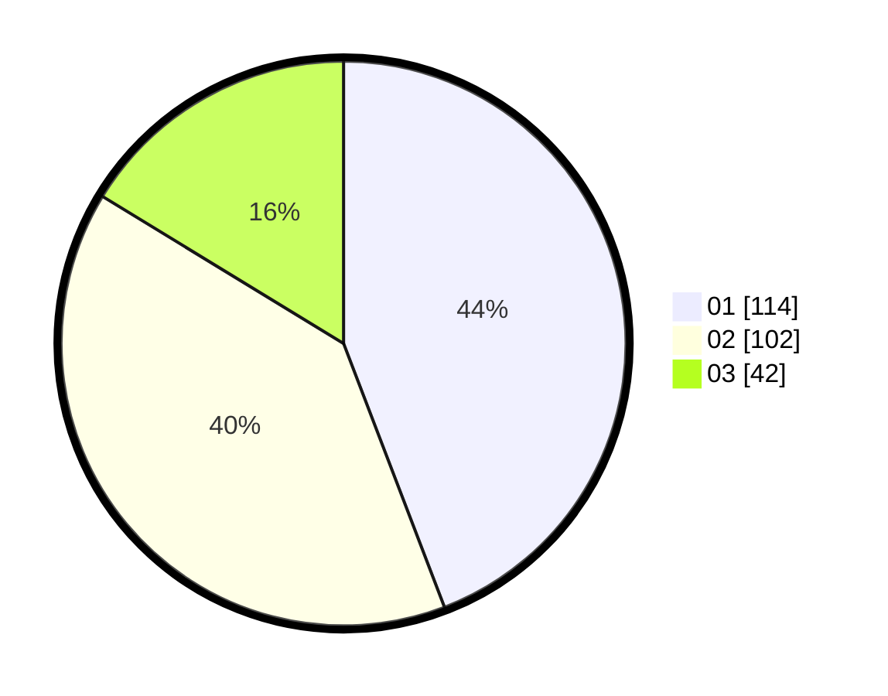

# Hasil

Hasil perolehan suara paslon dapat dilihat pada file paslon-01.txt, paslon-02.txt, dan paslon-03.txt.

Jika tidak ada, artinya data tersebut belum ada pada SIREKAP.

## Perolehan Suara

 * Paslon 01: **114**.
 * Paslon 02: **102**.
 * Paslon 03: **42**.

## Foto C Plano

https://sirekap-obj-formc.kpu.go.id/dc8d/pemilu/ppwp/31/74/09/10/06/3174091006038-20240214-194959--63c5c9f2-1a55-44e3-bed3-98ee85ebaedb.jpg

https://sirekap-obj-formc.kpu.go.id/dc8d/pemilu/ppwp/31/74/09/10/06/3174091006038-20240214-195115--043a0464-6525-4b5f-bc1e-26834222966d.jpg

https://sirekap-obj-formc.kpu.go.id/dc8d/pemilu/ppwp/31/74/09/10/06/3174091006038-20240214-195218--07cbd22b-de43-430f-9e25-9721d4b2912b.jpg

## DATA PEMILIH TETAP

Jumlah pemilih dalam DPT: **297**.
 * L: **155**.
 * P: **142**.

## DATA PENGGUNA HAK PILIH

Jumlah pengguna hak pilih dalam DPT: **250**.
 * L: **127**.
 * P: **123**.

Jumlah pengguna hak pilih dalam DPTb: **6**.
 * L: **3**.
 * P: **3**.

Jumlah pengguna hak pilih dalam DPK: **3**.
 * L: **2**.
 * P: **1**.

Jumlah pengguna hak pilih: **259**.
 * L: **132**.
 * P: **127**.

## JUMLAH SUARA SAH DAN TIDAK SAH

JUMLAH SELURUH SUARA SAH: **258**.

JUMLAH SUARA TIDAK SAH: **1**.

JUMLAH SELURUH SUARA SAH DAN SUARA TIDAK SAH: **259**.
