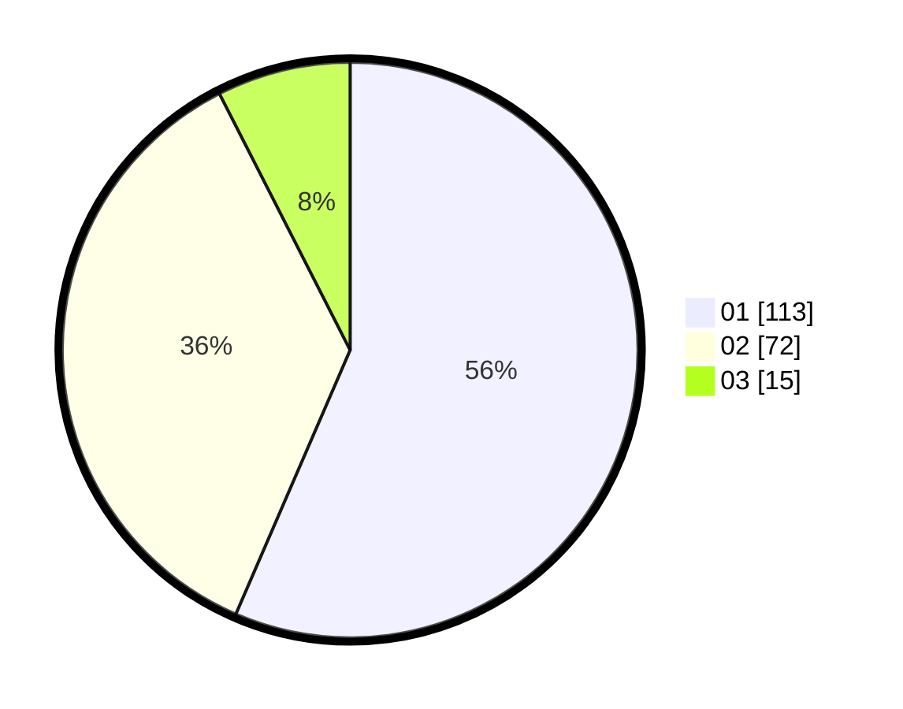

# Hasil

Hasil perolehan suara paslon dapat dilihat pada file paslon-01.txt, paslon-02.txt, dan paslon-03.txt.

Jika tidak ada, artinya data tersebut belum ada pada SIREKAP.

## Perolehan Suara

 * Paslon 01: **113**.
 * Paslon 02: **72**.
 * Paslon 03: **15**.

## Foto C Plano

https://sirekap-obj-formc.kpu.go.id/4658/pemilu/ppwp/31/74/09/10/06/3174091006043-20240214-192353--6b178f7c-8e1d-4956-812f-f2a973582720.jpg

https://sirekap-obj-formc.kpu.go.id/4658/pemilu/ppwp/31/74/09/10/06/3174091006043-20240214-202536--5b59e099-b5e7-4fe8-ae19-a45743207293.jpg

https://sirekap-obj-formc.kpu.go.id/4658/pemilu/ppwp/31/74/09/10/06/3174091006043-20240214-192549--00054494-78f2-419a-83fc-2713198fdb01.jpg

## DATA PEMILIH TETAP

Jumlah pemilih dalam DPT: **214**.
 * L: **107**.
 * P: **107**.

## DATA PENGGUNA HAK PILIH

Jumlah pengguna hak pilih dalam DPT: **178**.
 * L: **86**.
 * P: **92**.

Jumlah pengguna hak pilih dalam DPTb: **14**.
 * L: **8**.
 * P: **6**.

Jumlah pengguna hak pilih dalam DPK: **10**.
 * L: **6**.
 * P: **4**.

Jumlah pengguna hak pilih: **202**.
 * L: **100**.
 * P: **102**.

## JUMLAH SUARA SAH DAN TIDAK SAH

JUMLAH SELURUH SUARA SAH: **200**.

JUMLAH SUARA TIDAK SAH: **2**.

JUMLAH SELURUH SUARA SAH DAN SUARA TIDAK SAH: **202**.
