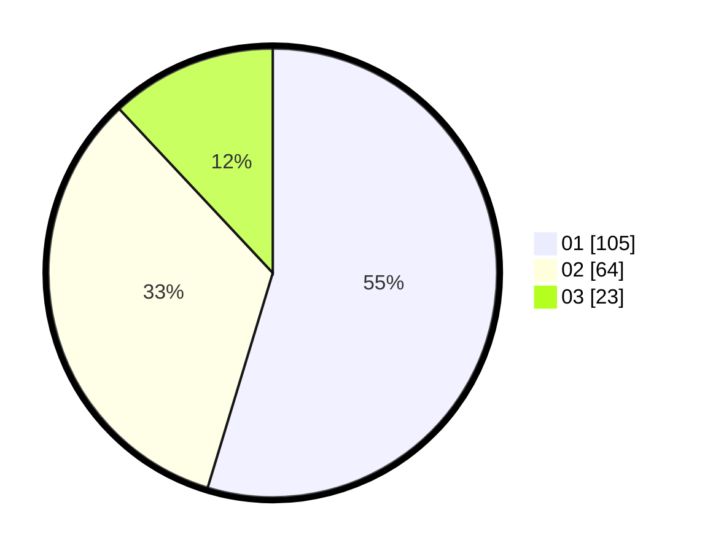

# Hasil

Hasil perolehan suara paslon dapat dilihat pada file paslon-01.txt, paslon-02.txt, dan paslon-03.txt.

Jika tidak ada, artinya data tersebut belum ada pada SIREKAP.

## Perolehan Suara

 * Paslon 01: **105**.
 * Paslon 02: **64**.
 * Paslon 03: **23**.

## Foto C Plano

https://sirekap-obj-formc.kpu.go.id/8f0d/pemilu/ppwp/31/74/09/10/06/3174091006045-20240214-193502--72c02411-ad38-4c38-abd2-ffe8976d7792.jpg

https://sirekap-obj-formc.kpu.go.id/8f0d/pemilu/ppwp/31/74/09/10/06/3174091006045-20240214-184932--cc2524c7-3e53-4eb9-b89b-b066e29b4fa2.jpg

https://sirekap-obj-formc.kpu.go.id/8f0d/pemilu/ppwp/31/74/09/10/06/3174091006045-20240214-184946--cdaf38c3-f491-4b44-a062-9575ed7ad550.jpg

## DATA PEMILIH TETAP

Jumlah pemilih dalam DPT: **227**.
 * L: **110**.
 * P: **117**.

## DATA PENGGUNA HAK PILIH

Jumlah pengguna hak pilih dalam DPT: **185**.
 * L: **87**.
 * P: **98**.

Jumlah pengguna hak pilih dalam DPTb: **6**.
 * L: **3**.
 * P: **3**.

Jumlah pengguna hak pilih dalam DPK: **6**.
 * L: **2**.
 * P: **4**.

Jumlah pengguna hak pilih: **197**.
 * L: **92**.
 * P: **105**.

## JUMLAH SUARA SAH DAN TIDAK SAH

JUMLAH SELURUH SUARA SAH: **192**.

JUMLAH SUARA TIDAK SAH: **5**.

JUMLAH SELURUH SUARA SAH DAN SUARA TIDAK SAH: **197**.
