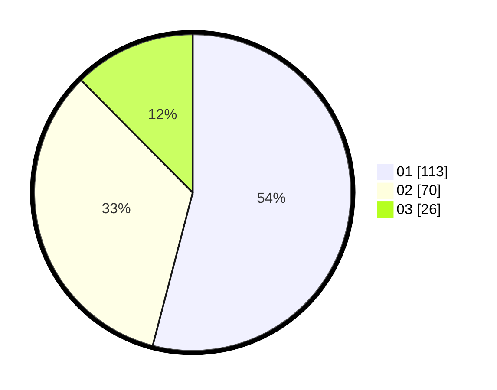

# Hasil

Hasil perolehan suara paslon dapat dilihat pada file paslon-01.txt, paslon-02.txt, dan paslon-03.txt.

Jika tidak ada, artinya data tersebut belum ada pada SIREKAP.

## Perolehan Suara

 * Paslon 01: **113**.
 * Paslon 02: **70**.
 * Paslon 03: **26**.

## Foto C Plano

https://sirekap-obj-formc.kpu.go.id/f56e/pemilu/ppwp/31/74/09/10/06/3174091006048-20240214-193243--297d57d8-d887-4b26-87d9-36f34b50cc73.jpg

https://sirekap-obj-formc.kpu.go.id/f56e/pemilu/ppwp/31/74/09/10/06/3174091006048-20240214-155752--803bb309-75cb-420d-bc2a-5213fa1250b0.jpg

https://sirekap-obj-formc.kpu.go.id/f56e/pemilu/ppwp/31/74/09/10/06/3174091006048-20240214-155806--73cbe78d-1896-4f43-aa90-79a7e03370f2.jpg

## DATA PEMILIH TETAP

Jumlah pemilih dalam DPT: **245**.
 * L: **130**.
 * P: **115**.

## DATA PENGGUNA HAK PILIH

Jumlah pengguna hak pilih dalam DPT: **202**.
 * L: **105**.
 * P: **97**.

Jumlah pengguna hak pilih dalam DPTb: **9**.
 * L: **9**.
 * P: **0**.

Jumlah pengguna hak pilih dalam DPK: **0**.
 * L: **0**.
 * P: **0**.

Jumlah pengguna hak pilih: **211**.
 * L: **114**.
 * P: **97**.

## JUMLAH SUARA SAH DAN TIDAK SAH

JUMLAH SELURUH SUARA SAH: **209**.

JUMLAH SUARA TIDAK SAH: **2**.

JUMLAH SELURUH SUARA SAH DAN SUARA TIDAK SAH: **211**.
