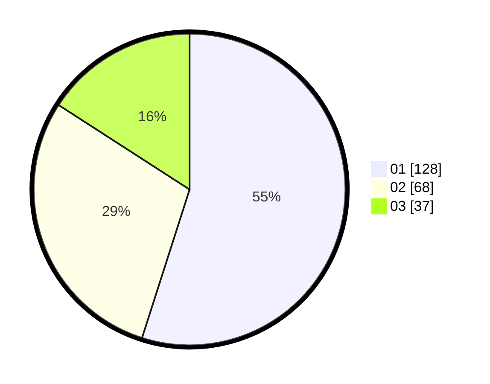

# Hasil

Hasil perolehan suara paslon dapat dilihat pada file paslon-01.txt, paslon-02.txt, dan paslon-03.txt.

Jika tidak ada, artinya data tersebut belum ada pada SIREKAP.

## Perolehan Suara

 * Paslon 01: **128**.
 * Paslon 02: **68**.
 * Paslon 03: **37**.

## Foto C Plano

https://sirekap-obj-formc.kpu.go.id/5534/pemilu/ppwp/31/74/09/10/06/3174091006049-20240214-235714--b353ae86-d3fd-4249-b232-9218f7e206e6.jpg

https://sirekap-obj-formc.kpu.go.id/5534/pemilu/ppwp/31/74/09/10/06/3174091006049-20240214-235740--a5b930dd-ce2d-46e1-84bf-d5a6f6b6b9c9.jpg

https://sirekap-obj-formc.kpu.go.id/5534/pemilu/ppwp/31/74/09/10/06/3174091006049-20240214-235804--54d39ebb-ebc1-4fa1-a18b-8a924d5c88b7.jpg

## DATA PEMILIH TETAP

Jumlah pemilih dalam DPT: **254**.
 * L: **128**.
 * P: **126**.

## DATA PENGGUNA HAK PILIH

Jumlah pengguna hak pilih dalam DPT: **224**.
 * L: **109**.
 * P: **115**.

Jumlah pengguna hak pilih dalam DPTb: **10**.
 * L: **8**.
 * P: **2**.

Jumlah pengguna hak pilih dalam DPK: **2**.
 * L: **1**.
 * P: **1**.

Jumlah pengguna hak pilih: **236**.
 * L: **118**.
 * P: **118**.

## JUMLAH SUARA SAH DAN TIDAK SAH

JUMLAH SELURUH SUARA SAH: **233**.

JUMLAH SUARA TIDAK SAH: **3**.

JUMLAH SELURUH SUARA SAH DAN SUARA TIDAK SAH: **236**.
