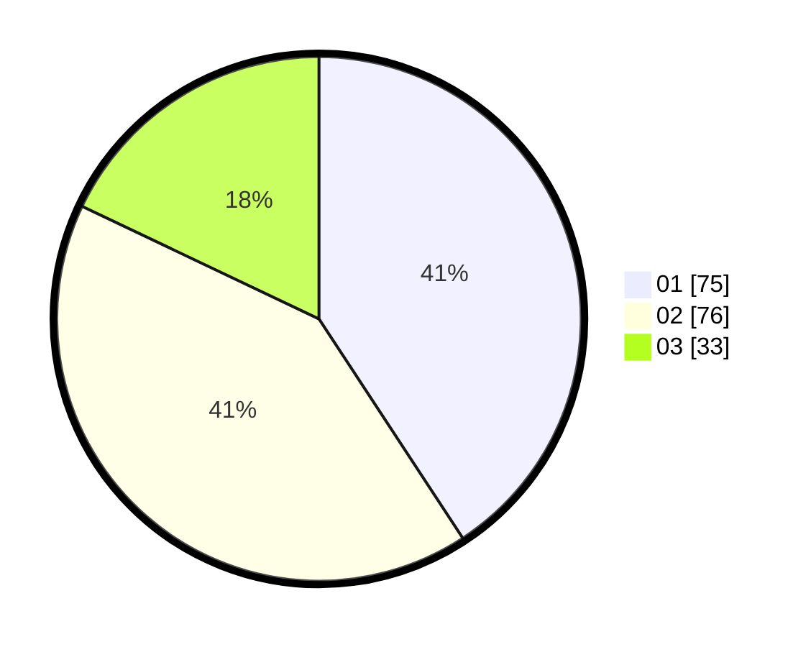

# Hasil

Hasil perolehan suara paslon dapat dilihat pada file paslon-01.txt, paslon-02.txt, dan paslon-03.txt.

Jika tidak ada, artinya data tersebut belum ada pada SIREKAP.

## Perolehan Suara

 * Paslon 01: **75**.
 * Paslon 02: **76**.
 * Paslon 03: **33**.

## Foto C Plano

https://sirekap-obj-formc.kpu.go.id/9b33/pemilu/ppwp/31/74/09/10/06/3174091006056-20240214-184915--cfe4f884-6356-4be1-a7c4-623c34ca0233.jpg

https://sirekap-obj-formc.kpu.go.id/9b33/pemilu/ppwp/31/74/09/10/06/3174091006056-20240214-184637--df4096ae-c8b8-4c76-af4c-ed7453286a4c.jpg

https://sirekap-obj-formc.kpu.go.id/9b33/pemilu/ppwp/31/74/09/10/06/3174091006056-20240214-184454--0e3c52b3-7d86-4db0-aa04-0b37b1a62e7f.jpg

## DATA PEMILIH TETAP

Jumlah pemilih dalam DPT: **237**.
 * L: **128**.
 * P: **109**.

## DATA PENGGUNA HAK PILIH

Jumlah pengguna hak pilih dalam DPT: **179**.
 * L: **77**.
 * P: **102**.

Jumlah pengguna hak pilih dalam DPTb: **2**.
 * L: **1**.
 * P: **1**.

Jumlah pengguna hak pilih dalam DPK: **3**.
 * L: **1**.
 * P: **2**.

Jumlah pengguna hak pilih: **184**.
 * L: **79**.
 * P: **105**.

## JUMLAH SUARA SAH DAN TIDAK SAH

JUMLAH SELURUH SUARA SAH: **184**.

JUMLAH SUARA TIDAK SAH: **0**.

JUMLAH SELURUH SUARA SAH DAN SUARA TIDAK SAH: **184**.
