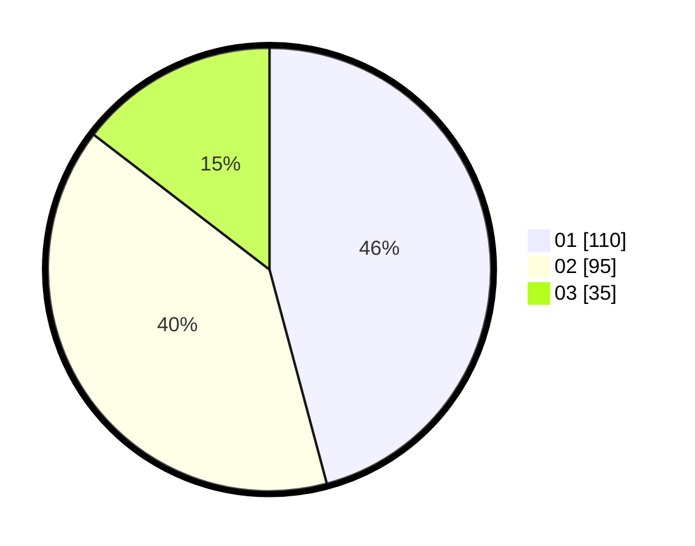

# Hasil

Hasil perolehan suara paslon dapat dilihat pada file paslon-01.txt, paslon-02.txt, dan paslon-03.txt.

Jika tidak ada, artinya data tersebut belum ada pada SIREKAP.

## Perolehan Suara

 * Paslon 01: **110**.
 * Paslon 02: **95**.
 * Paslon 03: **35**.

## Foto C Plano

https://sirekap-obj-formc.kpu.go.id/1dbf/pemilu/ppwp/31/74/09/10/06/3174091006058-20240216-002755--74c2fb69-8161-4590-8543-2b35a1eb50f7.jpg

https://sirekap-obj-formc.kpu.go.id/1dbf/pemilu/ppwp/31/74/09/10/06/3174091006058-20240216-002802--34197052-cdaf-4f9a-847c-3f1730469a2f.jpg

https://sirekap-obj-formc.kpu.go.id/1dbf/pemilu/ppwp/31/74/09/10/06/3174091006058-20240216-002808--5ab8474f-2ec1-417d-895e-aa24fb91d599.jpg

## DATA PEMILIH TETAP

Jumlah pemilih dalam DPT: **281**.
 * L: **139**.
 * P: **142**.

## DATA PENGGUNA HAK PILIH

Jumlah pengguna hak pilih dalam DPT: **245**.
 * L: **120**.
 * P: **125**.

Jumlah pengguna hak pilih dalam DPTb: **1**.
 * L: **0**.
 * P: **1**.

Jumlah pengguna hak pilih dalam DPK: **2**.
 * L: **1**.
 * P: **1**.

Jumlah pengguna hak pilih: **248**.
 * L: **121**.
 * P: **127**.

## JUMLAH SUARA SAH DAN TIDAK SAH

JUMLAH SELURUH SUARA SAH: **240**.

JUMLAH SUARA TIDAK SAH: **8**.

JUMLAH SELURUH SUARA SAH DAN SUARA TIDAK SAH: **248**.
