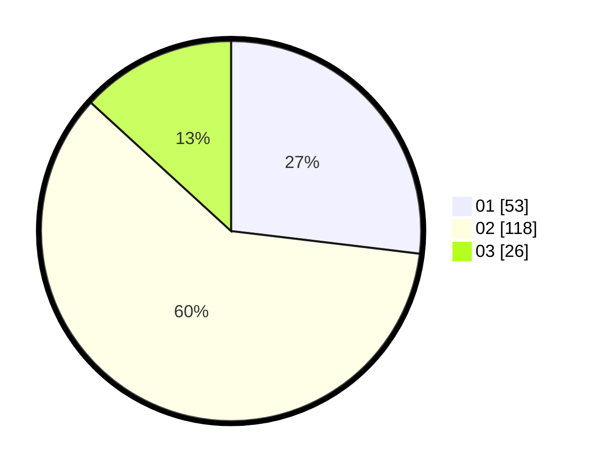

# Hasil

Hasil perolehan suara paslon dapat dilihat pada file paslon-01.txt, paslon-02.txt, dan paslon-03.txt.

Jika tidak ada, artinya data tersebut belum ada pada SIREKAP.

## Perolehan Suara

 * Paslon 01: **53**.
 * Paslon 02: **118**.
 * Paslon 03: **26**.

## Foto C Plano

https://sirekap-obj-formc.kpu.go.id/1301/pemilu/ppwp/31/74/09/10/06/3174091006062-20240214-193328--9e933c1c-03b4-4b96-90ce-c8e734b128c2.jpg

https://sirekap-obj-formc.kpu.go.id/1301/pemilu/ppwp/31/74/09/10/06/3174091006062-20240214-195056--8957c3c1-66c4-4499-8beb-48d5e4433cb1.jpg

https://sirekap-obj-formc.kpu.go.id/1301/pemilu/ppwp/31/74/09/10/06/3174091006062-20240214-192738--d8a65c77-3ff5-4ae9-9a17-179106db2e13.jpg

## DATA PEMILIH TETAP

Jumlah pemilih dalam DPT: **202**.
 * L: **102**.
 * P: **100**.

## DATA PENGGUNA HAK PILIH

Jumlah pengguna hak pilih dalam DPT: **201**.
 * L: **102**.
 * P: **79**.

Jumlah pengguna hak pilih dalam DPTb: **0**.
 * L: **60**.
 * P: **7**.

Jumlah pengguna hak pilih dalam DPK: **1**.
 * L: **0**.
 * P: **1**.

Jumlah pengguna hak pilih: **202**.
 * L: **102**.
 * P: **100**.

## JUMLAH SUARA SAH DAN TIDAK SAH

JUMLAH SELURUH SUARA SAH: **197**.

JUMLAH SUARA TIDAK SAH: **5**.

JUMLAH SELURUH SUARA SAH DAN SUARA TIDAK SAH: **202**.
