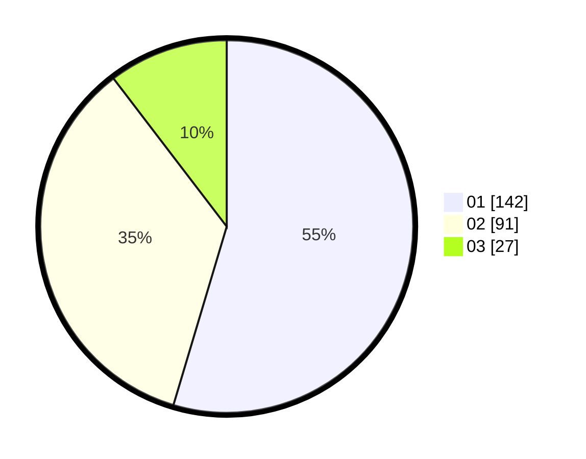

# Hasil

Hasil perolehan suara paslon dapat dilihat pada file paslon-01.txt, paslon-02.txt, dan paslon-03.txt.

Jika tidak ada, artinya data tersebut belum ada pada SIREKAP.

## Perolehan Suara

 * Paslon 01: **142**.
 * Paslon 02: **91**.
 * Paslon 03: **27**.

## Foto C Plano

https://sirekap-obj-formc.kpu.go.id/bf02/pemilu/ppwp/31/74/09/10/06/3174091006067-20240214-194153--2777f8ec-c4fd-4499-85a1-3a19bde19526.jpg

https://sirekap-obj-formc.kpu.go.id/bf02/pemilu/ppwp/31/74/09/10/06/3174091006067-20240214-194207--a58e28d7-e7ea-47d9-afb2-32cb5da1e543.jpg

https://sirekap-obj-formc.kpu.go.id/bf02/pemilu/ppwp/31/74/09/10/06/3174091006067-20240214-194215--8113226d-8062-4dee-b342-1782071e9728.jpg

## DATA PEMILIH TETAP

Jumlah pemilih dalam DPT: **291**.
 * L: **142**.
 * P: **149**.

## DATA PENGGUNA HAK PILIH

Jumlah pengguna hak pilih dalam DPT: **254**.
 * L: **121**.
 * P: **133**.

Jumlah pengguna hak pilih dalam DPTb: **10**.
 * L: **9**.
 * P: **1**.

Jumlah pengguna hak pilih dalam DPK: **2**.
 * L: **1**.
 * P: **1**.

Jumlah pengguna hak pilih: **266**.
 * L: **131**.
 * P: **135**.

## JUMLAH SUARA SAH DAN TIDAK SAH

JUMLAH SELURUH SUARA SAH: **260**.

JUMLAH SUARA TIDAK SAH: **6**.

JUMLAH SELURUH SUARA SAH DAN SUARA TIDAK SAH: **266**.
