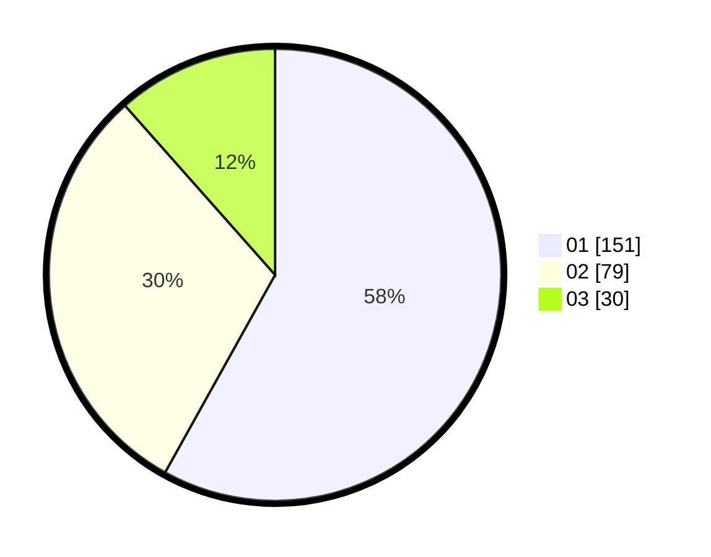

# Hasil

Hasil perolehan suara paslon dapat dilihat pada file paslon-01.txt, paslon-02.txt, dan paslon-03.txt.

Jika tidak ada, artinya data tersebut belum ada pada SIREKAP.

## Perolehan Suara

 * Paslon 01: **151**.
 * Paslon 02: **79**.
 * Paslon 03: **30**.

## Foto C Plano

https://sirekap-obj-formc.kpu.go.id/1dc4/pemilu/ppwp/31/74/09/10/06/3174091006069-20240214-203333--53d82f70-8a7e-4477-9fc5-7972b786dff0.jpg

https://sirekap-obj-formc.kpu.go.id/1dc4/pemilu/ppwp/31/74/09/10/06/3174091006069-20240214-191949--7536f695-f183-4aa6-bce3-83deea6f07a5.jpg

https://sirekap-obj-formc.kpu.go.id/1dc4/pemilu/ppwp/31/74/09/10/06/3174091006069-20240214-192014--1cafe4f2-14f2-4e1c-a99e-5a9803c0484a.jpg

## DATA PEMILIH TETAP

Jumlah pemilih dalam DPT: **293**.
 * L: **142**.
 * P: **151**.

## DATA PENGGUNA HAK PILIH

Jumlah pengguna hak pilih dalam DPT: **249**.
 * L: **118**.
 * P: **131**.

Jumlah pengguna hak pilih dalam DPTb: **15**.
 * L: **4**.
 * P: **11**.

Jumlah pengguna hak pilih dalam DPK: **0**.
 * L: **0**.
 * P: **0**.

Jumlah pengguna hak pilih: **264**.
 * L: **122**.
 * P: **142**.

## JUMLAH SUARA SAH DAN TIDAK SAH

JUMLAH SELURUH SUARA SAH: **260**.

JUMLAH SUARA TIDAK SAH: **4**.

JUMLAH SELURUH SUARA SAH DAN SUARA TIDAK SAH: **264**.
