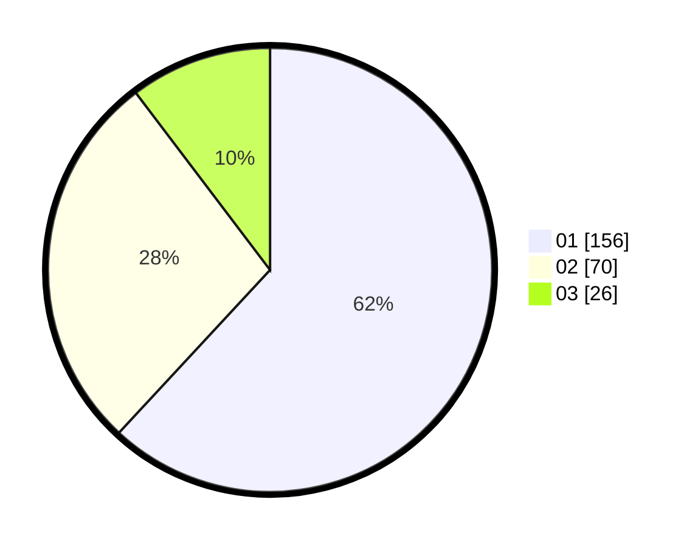

# Hasil

Hasil perolehan suara paslon dapat dilihat pada file paslon-01.txt, paslon-02.txt, dan paslon-03.txt.

Jika tidak ada, artinya data tersebut belum ada pada SIREKAP.

## Perolehan Suara

 * Paslon 01: **156**.
 * Paslon 02: **70**.
 * Paslon 03: **26**.

## Foto C Plano

https://sirekap-obj-formc.kpu.go.id/9668/pemilu/ppwp/31/74/09/10/06/3174091006076-20240214-155154--eaa87662-f605-484a-b2b2-f62bb7e32503.jpg

https://sirekap-obj-formc.kpu.go.id/9668/pemilu/ppwp/31/74/09/10/06/3174091006076-20240214-155548--5805cae9-58dc-428f-8223-81c323923188.jpg

https://sirekap-obj-formc.kpu.go.id/9668/pemilu/ppwp/31/74/09/10/06/3174091006076-20240214-155730--3d9d8bd1-3974-46e8-a3d2-ed39e1e3a7d0.jpg

## DATA PEMILIH TETAP

Jumlah pemilih dalam DPT: **285**.
 * L: **135**.
 * P: **150**.

## DATA PENGGUNA HAK PILIH

Jumlah pengguna hak pilih dalam DPT: **243**.
 * L: **115**.
 * P: **128**.

Jumlah pengguna hak pilih dalam DPTb: **15**.
 * L: **13**.
 * P: **2**.

Jumlah pengguna hak pilih dalam DPK: **2**.
 * L: **1**.
 * P: **1**.

Jumlah pengguna hak pilih: **260**.
 * L: **129**.
 * P: **131**.

## JUMLAH SUARA SAH DAN TIDAK SAH

JUMLAH SELURUH SUARA SAH: **252**.

JUMLAH SUARA TIDAK SAH: **8**.

JUMLAH SELURUH SUARA SAH DAN SUARA TIDAK SAH: **260**.
