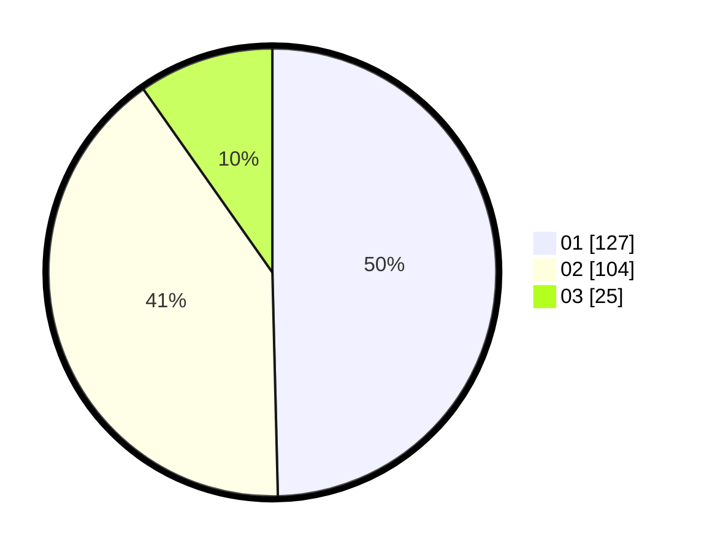

# Hasil

Hasil perolehan suara paslon dapat dilihat pada file paslon-01.txt, paslon-02.txt, dan paslon-03.txt.

Jika tidak ada, artinya data tersebut belum ada pada SIREKAP.

## Perolehan Suara

 * Paslon 01: **127**.
 * Paslon 02: **104**.
 * Paslon 03: **25**.

## Foto C Plano

https://sirekap-obj-formc.kpu.go.id/d9da/pemilu/ppwp/31/74/09/10/06/3174091006081-20240214-155733--9a4f2801-aebf-4826-849c-7dc183ea1cd1.jpg

https://sirekap-obj-formc.kpu.go.id/d9da/pemilu/ppwp/31/74/09/10/06/3174091006081-20240214-160105--70c250d3-f586-44e4-8ecb-3e9e773d3756.jpg
