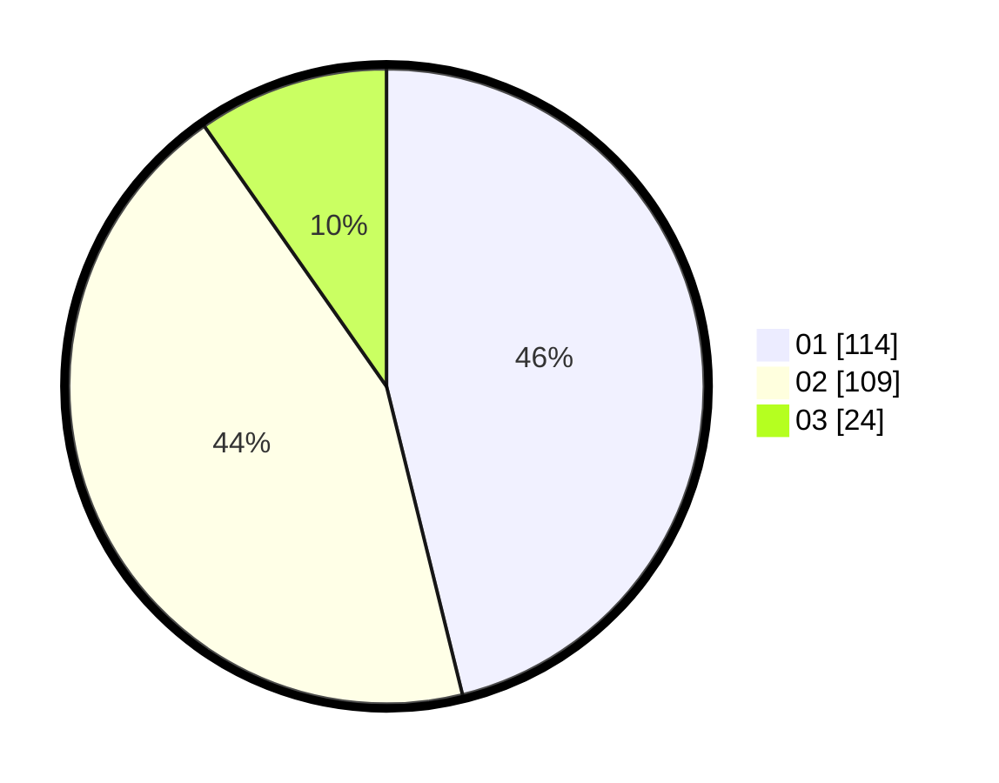

# Hasil

Hasil perolehan suara paslon dapat dilihat pada file paslon-01.txt, paslon-02.txt, dan paslon-03.txt.

Jika tidak ada, artinya data tersebut belum ada pada SIREKAP.

## Perolehan Suara

 * Paslon 01: **114**.
 * Paslon 02: **109**.
 * Paslon 03: **24**.

## Foto C Plano

https://sirekap-obj-formc.kpu.go.id/7b3d/pemilu/ppwp/31/74/09/10/06/3174091006083-20240214-231443--a11a43a6-9bf6-41bd-b6b7-bf2db8db4912.jpg

https://sirekap-obj-formc.kpu.go.id/7b3d/pemilu/ppwp/31/74/09/10/06/3174091006083-20240214-155656--bc7406e6-994b-43aa-ac3e-2f4d6d949d23.jpg

https://sirekap-obj-formc.kpu.go.id/7b3d/pemilu/ppwp/31/74/09/10/06/3174091006083-20240214-231434--3a0a9ff4-4d58-437a-8fe9-9fba4d3d9189.jpg

## DATA PEMILIH TETAP

Jumlah pemilih dalam DPT: **248**.
 * L: **122**.
 * P: **126**.

## DATA PENGGUNA HAK PILIH

Jumlah pengguna hak pilih dalam DPT: **244**.
 * L: **121**.
 * P: **123**.

Jumlah pengguna hak pilih dalam DPTb: **0**.
 * L: **0**.
 * P: **0**.

Jumlah pengguna hak pilih dalam DPK: **4**.
 * L: **1**.
 * P: **3**.

Jumlah pengguna hak pilih: **248**.
 * L: **122**.
 * P: **126**.

## JUMLAH SUARA SAH DAN TIDAK SAH

JUMLAH SELURUH SUARA SAH: **247**.

JUMLAH SUARA TIDAK SAH: **1**.

JUMLAH SELURUH SUARA SAH DAN SUARA TIDAK SAH: **248**.
