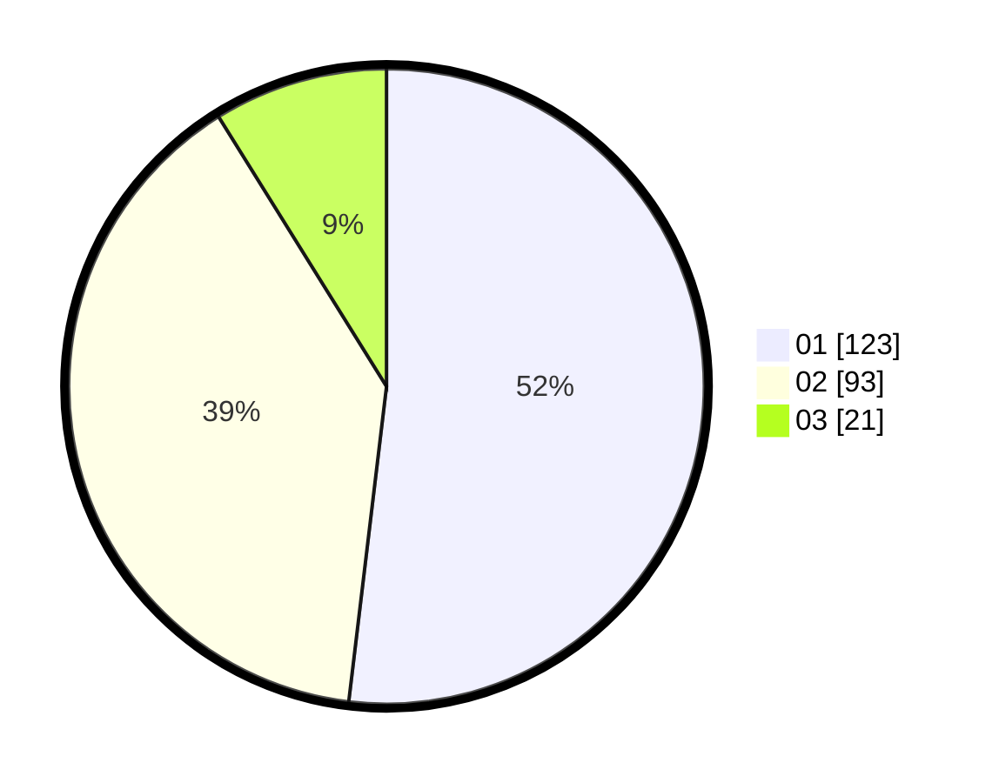

# Hasil

Hasil perolehan suara paslon dapat dilihat pada file paslon-01.txt, paslon-02.txt, dan paslon-03.txt.

Jika tidak ada, artinya data tersebut belum ada pada SIREKAP.

## Perolehan Suara

 * Paslon 01: **123**.
 * Paslon 02: **93**.
 * Paslon 03: **21**.

## Foto C Plano

https://sirekap-obj-formc.kpu.go.id/35dd/pemilu/ppwp/31/74/09/10/06/3174091006085-20240215-030054--483b68ee-21c8-43f2-8c8d-33edf1c3d323.jpg

https://sirekap-obj-formc.kpu.go.id/35dd/pemilu/ppwp/31/74/09/10/06/3174091006085-20240215-030151--92f6ce5d-692f-4394-8a9f-5b523b3a1816.jpg

https://sirekap-obj-formc.kpu.go.id/35dd/pemilu/ppwp/31/74/09/10/06/3174091006085-20240215-030235--7fbb523a-52b4-4995-8690-d463686f4a71.jpg
