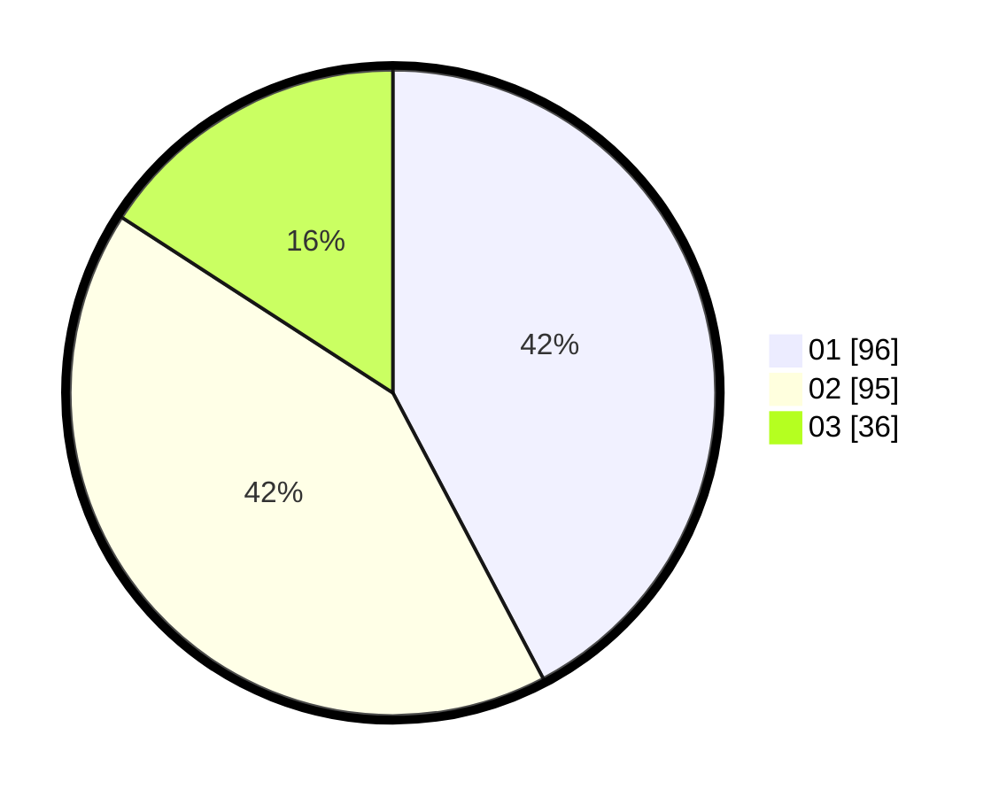

# Hasil

Hasil perolehan suara paslon dapat dilihat pada file paslon-01.txt, paslon-02.txt, dan paslon-03.txt.

Jika tidak ada, artinya data tersebut belum ada pada SIREKAP.

## Perolehan Suara

 * Paslon 01: **96**.
 * Paslon 02: **95**.
 * Paslon 03: **36**.

## Foto C Plano

https://sirekap-obj-formc.kpu.go.id/fd93/pemilu/ppwp/31/74/09/10/06/3174091006092-20240215-195549--9a31d1e8-f209-4f1e-ab76-51c06384c40a.jpg

https://sirekap-obj-formc.kpu.go.id/fd93/pemilu/ppwp/31/74/09/10/06/3174091006092-20240215-195610--07409506-ada8-4109-9d4c-dfce7852e393.jpg

https://sirekap-obj-formc.kpu.go.id/fd93/pemilu/ppwp/31/74/09/10/06/3174091006092-20240215-195559--11bc3cc0-4d47-489b-8b3f-1bffdd0d0eac.jpg

## DATA PEMILIH TETAP

Jumlah pemilih dalam DPT: **270**.
 * L: **139**.
 * P: **131**.

## DATA PENGGUNA HAK PILIH

Jumlah pengguna hak pilih dalam DPT: **232**.
 * L: **113**.
 * P: **119**.

Jumlah pengguna hak pilih dalam DPTb: **0**.
 * L: **0**.
 * P: **0**.

Jumlah pengguna hak pilih dalam DPK: **1**.
 * L: **1**.
 * P: **0**.

Jumlah pengguna hak pilih: **233**.
 * L: **114**.
 * P: **119**.

## JUMLAH SUARA SAH DAN TIDAK SAH

JUMLAH SELURUH SUARA SAH: **227**.

JUMLAH SUARA TIDAK SAH: **6**.

JUMLAH SELURUH SUARA SAH DAN SUARA TIDAK SAH: **233**.
