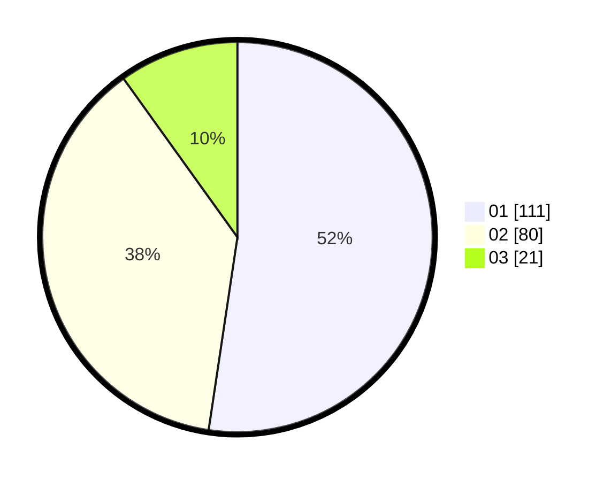

# Hasil

Hasil perolehan suara paslon dapat dilihat pada file paslon-01.txt, paslon-02.txt, dan paslon-03.txt.

Jika tidak ada, artinya data tersebut belum ada pada SIREKAP.

## Perolehan Suara

 * Paslon 01: **111**.
 * Paslon 02: **80**.
 * Paslon 03: **21**.

## Foto C Plano

https://sirekap-obj-formc.kpu.go.id/2bd9/pemilu/ppwp/31/74/09/10/06/3174091006101-20240215-003159--b85f42ee-61c2-420e-9cbf-9b1536b15544.jpg

https://sirekap-obj-formc.kpu.go.id/2bd9/pemilu/ppwp/31/74/09/10/06/3174091006101-20240215-003245--a92728d9-083f-42c4-9328-607cbe9ce351.jpg

https://sirekap-obj-formc.kpu.go.id/2bd9/pemilu/ppwp/31/74/09/10/06/3174091006101-20240215-003254--55310dba-e4cc-4242-b246-32bdf35009c5.jpg

## DATA PEMILIH TETAP

Jumlah pemilih dalam DPT: **254**.
 * L: **126**.
 * P: **128**.

## DATA PENGGUNA HAK PILIH

Jumlah pengguna hak pilih dalam DPT: **212**.
 * L: **101**.
 * P: **111**.

Jumlah pengguna hak pilih dalam DPTb: **201**.
 * L: **1**.
 * P: **0**.

Jumlah pengguna hak pilih dalam DPK: **2**.
 * L: **1**.
 * P: **1**.

Jumlah pengguna hak pilih: **215**.
 * L: **103**.
 * P: **112**.

## JUMLAH SUARA SAH DAN TIDAK SAH

JUMLAH SELURUH SUARA SAH: **212**.

JUMLAH SUARA TIDAK SAH: **3**.

JUMLAH SELURUH SUARA SAH DAN SUARA TIDAK SAH: **215**.
