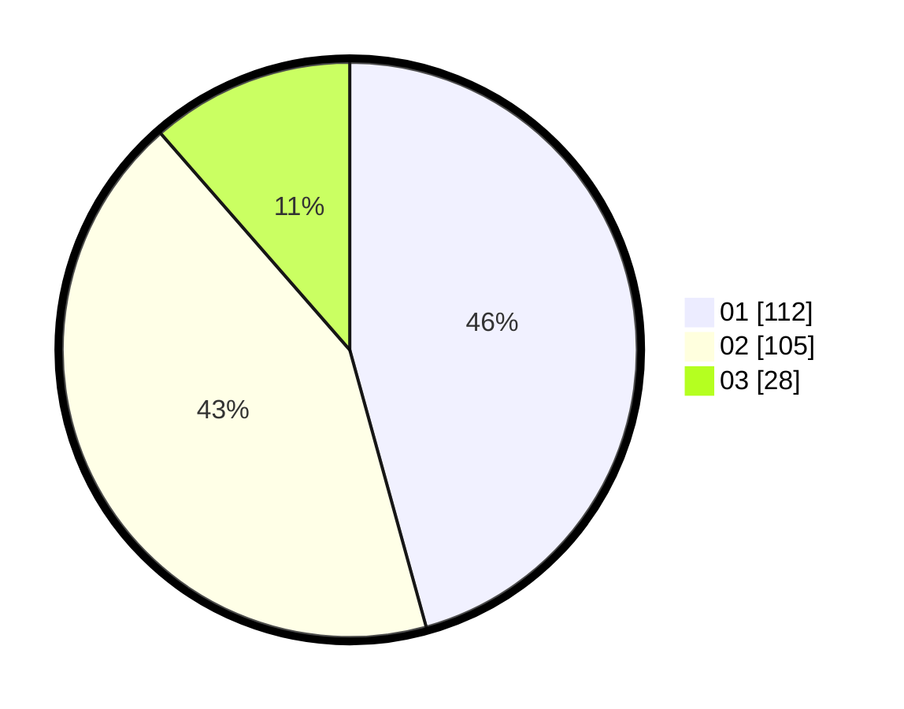

# Hasil

Hasil perolehan suara paslon dapat dilihat pada file paslon-01.txt, paslon-02.txt, dan paslon-03.txt.

Jika tidak ada, artinya data tersebut belum ada pada SIREKAP.

## Perolehan Suara

 * Paslon 01: **112**.
 * Paslon 02: **105**.
 * Paslon 03: **28**.

## Foto C Plano

https://sirekap-obj-formc.kpu.go.id/aa30/pemilu/ppwp/31/74/09/10/06/3174091006109-20240216-062424--7378c50e-1f97-4f5f-922a-d505b9f6d731.jpg

https://sirekap-obj-formc.kpu.go.id/aa30/pemilu/ppwp/31/74/09/10/06/3174091006109-20240214-141638--0bced5fd-d8a5-496d-b53f-24fc73ec60cc.jpg

https://sirekap-obj-formc.kpu.go.id/aa30/pemilu/ppwp/31/74/09/10/06/3174091006109-20240214-160102--0fd003ab-445a-47c9-bd9a-fcc5df15361a.jpg

## DATA PEMILIH TETAP

Jumlah pemilih dalam DPT: **229**.
 * L: **102**.
 * P: **127**.

## DATA PENGGUNA HAK PILIH

Jumlah pengguna hak pilih dalam DPT: **229**.
 * L: **102**.
 * P: **127**.

Jumlah pengguna hak pilih dalam DPTb: **13**.
 * L: **3**.
 * P: **10**.

Jumlah pengguna hak pilih dalam DPK: **6**.
 * L: **3**.
 * P: **3**.

Jumlah pengguna hak pilih: **248**.
 * L: **108**.
 * P: **140**.

## JUMLAH SUARA SAH DAN TIDAK SAH

JUMLAH SELURUH SUARA SAH: **245**.

JUMLAH SUARA TIDAK SAH: **2**.

JUMLAH SELURUH SUARA SAH DAN SUARA TIDAK SAH: **247**.
