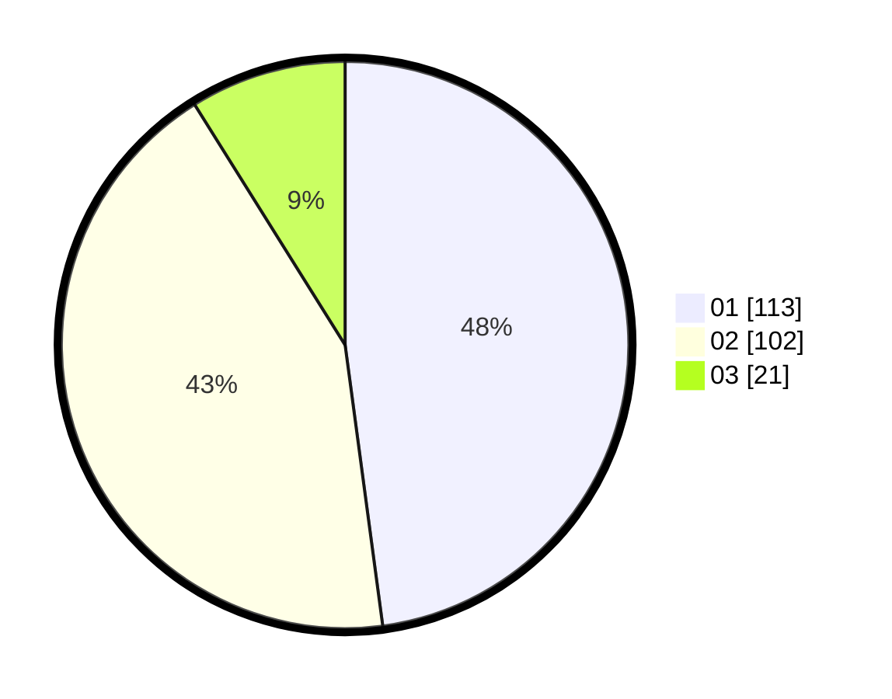

# Hasil

Hasil perolehan suara paslon dapat dilihat pada file paslon-01.txt, paslon-02.txt, dan paslon-03.txt.

Jika tidak ada, artinya data tersebut belum ada pada SIREKAP.

## Perolehan Suara

 * Paslon 01: **113**.
 * Paslon 02: **102**.
 * Paslon 03: **21**.

## Foto C Plano

https://sirekap-obj-formc.kpu.go.id/e150/pemilu/ppwp/31/74/09/10/06/3174091006114-20240214-191019--5dc166da-035b-4b97-a663-97d9a52f26fe.jpg

https://sirekap-obj-formc.kpu.go.id/e150/pemilu/ppwp/31/74/09/10/06/3174091006114-20240214-191111--0d871352-fecb-4160-bffd-0a55bf1bd45e.jpg

https://sirekap-obj-formc.kpu.go.id/e150/pemilu/ppwp/31/74/09/10/06/3174091006114-20240214-190820--94c0eea6-d268-4859-b41c-122b1bbac94b.jpg

## DATA PEMILIH TETAP

Jumlah pemilih dalam DPT: **263**.
 * L: **136**.
 * P: **127**.

## DATA PENGGUNA HAK PILIH

Jumlah pengguna hak pilih dalam DPT: **226**.
 * L: **113**.
 * P: **113**.

Jumlah pengguna hak pilih dalam DPTb: **11**.
 * L: **2**.
 * P: **9**.

Jumlah pengguna hak pilih dalam DPK: **1**.
 * L: **0**.
 * P: **1**.

Jumlah pengguna hak pilih: **238**.
 * L: **115**.
 * P: **123**.

## JUMLAH SUARA SAH DAN TIDAK SAH

JUMLAH SELURUH SUARA SAH: **236**.

JUMLAH SUARA TIDAK SAH: **2**.

JUMLAH SELURUH SUARA SAH DAN SUARA TIDAK SAH: **238**.
